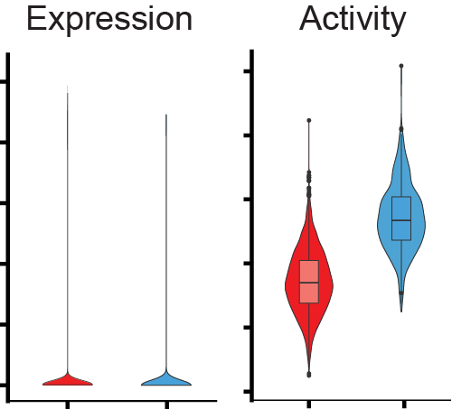

**S**ingle-**C**ell **M**utual **I**nformation-based **N**etwork **E**ngineering **R**anger
{: .fs-6 .fw-300 }

[Get started now](Get started){: .btn .btn-primary .fs-5 .mb-4 .mb-md-0 .mr-2 } 
[View it on GitHub](https://github.com/jyyulab/scMINER){: .btn .fs-5 }

---

{:.no_toc}

## Overview
**scMINER** is a **systems biology** toolkit for both quality control and down-stream analysis of high-throughput single cell RNA-seq data. 
For the better understanding of the sources of heterogeneity from single-cell RNA-seq data, scMINER enable users 
to identify and interpret **content-specific hidden drivers**, where the drivers can be either transcription 
factors (TF) or signaling factors (SIG). 

**scMINER** also includes new mutual information based approach [MICA](https://github.com/jyyulab/MICA) for cluster identification and improved scalable version of [SJARACNe](https://github.com/jyyulab/SJARACNe) for cell type-specific 
gene network reverse engineering.   

---
<table id="hd">
  <tr>    
    <td align="center" valign="middle"></td>
    <td valign="middle"><b>Hidden Driver</b>
    	<ul>
			<li>Cell type specific hidden drivers </li>
			<li>scMINER infered-activity from expression matrix</li>
			<li>Functional annotation for drivers and corresponding targets </li>
			<li>Comprehensive visualization kit for both expression and activity profiles</li>
		</ul>
    </td>
  </tr>
</table >  
  
<table id="mica" border="0">  
  <tr>    
    <td valign="middle"><b> MICA Clustering </b>
    	<ul>
			<li>Mutual information-based</li>
			<li>Non-linear distance matrix and dimension reduction methods</li>
			<li>Robust K-means based consensus clustering</li>
		</ul>
    </td>
    <td align="center" valign="middle"></td>
  </tr>
</table>  

<table id="network" border="0">
  <tr>    
    <td align="center" valign="middle"></td>
    <td valign="middle"><b> Context-based network </b>
    	<ul>
			<li>scRNA-seq based network re-engineering via SJARACNe</li>
			<li>Network rewiring under different biological conditions</li>
			<li>Network visualizaiton</li>
		</ul>
	</td>
  </tr>
</table>

## Citing scMINER
If scMINER is useful to your work, please cite the following paper

## Contact
The scMINER software is developed by [Yu Lab](https://www.stjude.org/directory/y/jiyang-yu.html) at [St. Jude 
Children's Research Hospital](https://www.stjude.org/). 

We’re very interested to hear feedback about using scMINER in your analysis. If you find any issues/bugs, or 
have any suggestions, please don't hesitate to create issues in [GitHub](https://github.com/jyyulab/scMINER/issues), 
or contact us directly. 

