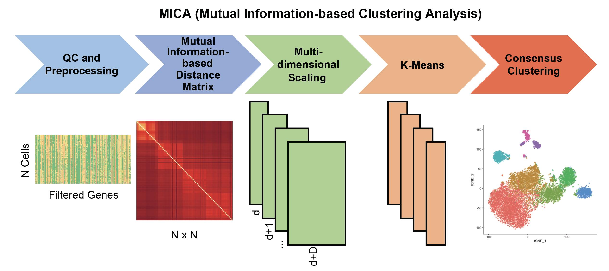

# Clustering Analysis with MICA
{:.no_toc}
MICA(Mutual Information based Clustering Analysis) is a nonlinear clustering analysis tool designed for scRNA-seq data. To install MIE (Mutual inforamtion estimator for distance matrix generation, module required for MICA) and MICA, please refer our [MIE](https://github.com/jyyulab/MIE) and [MICA](https://github.com/jyyulab/MICA) github page.  
{: .fs-6 .fw-300 }

## Table of contents
{: .no_toc .text-delta }
 
1. TOC
{:toc}

---
## Overview

 

MICA is a non-linear clustering analysis algorithm that incorporated:  
1. Fast mutual information estimation to construct cell-cell similarity matrix.  
2. Multidimensional scaling for stabilized dimension reduction.  
3. Consensus clustering from multiple individual runs of kmeans to generate robust clustering results.  


## Preprocssing
MICA module was implemented in python, which only includes clustering analysis. For preprocessing, MICA is compatitble with most published scRNA-seq preprocessing pipeline. However, we highly recommend users to follow our preprocessing framework utilizing `scMINER` R package.For detailed information, please see complementary tutorial in tab `Step by step demo with PBMC data`. 

> **notes** MICA only takes cell by gene txt file as input, we strongly recommend using `generateMICAinput` function to convert your input data to MICA standard input text file in R.


## Basic usage
For those who are not familiar with python, we designed a easy function in `scMINER` R package called `generate_MICA_rmd`to help users generate MICA command. 

### On local host
To perform MICA on local host, you need to specify `host= "local"`

```R
scMINER::generate_MICA_cmd(save_sh_at, #path to save shell script 
                  			input_file, #your MICA input file
                  			project_name, 
                  			num_cluster, #a vector of numerical number
                  			output_path, #path to MICA output
                  			host="local", 
		                    visualization="tsne" #or "umap")
```

or, you can create your own shell script as:

```SHELL
#!/usr/bin/env bash
mica local \
-i ./test_data/inputs/PBMC_Demo_MICA_input_mini.txt \
-p "test_local" \
-k 3 4 \
-o ./test_data/outputs/test_local/ \
```
To execute your shell script locally, you can
```SHELL
sh your_mica_cmd.sh

```

### On LSF
To perform MICA on LSF, you have to specify `host="lsf"`, which queue to submit your job `queue=[your_queue]`, and also memory requested for MICA.
```R
scMINER::generateMICAcmd(save_sh_at, #path to save shell script 
                            input_file, #your MICA input file
                            project_name, 
                            num_cluster, #a vector of numerical number
                            output_path, 
                            host="lsf", #or local
                            queue=NULL, #your queue to submit the job
                            memory=NULL, #specify if you use LSF, a vector of 4 numerical number
                            dim_reduction_method="MDS", 
                            visualization="tsne")
```

Or, you can create your shell script as:

```SHELL
#!/usr/bin/env bash
mica LSF \
-i ./test_data/inputs/PBMC_Demo_MICA_input_mini.txt \
-p "test_local" \
-k 3 4 \
-o ./test_data/outputs/test_local/ \
```

To execute your shell script on LSF, we suggest
```SHELL
bsub < your_mica_cmd.sh
```


## MICA Outputs

Each assigned number of k will output one folder containing following files:

1. `[Project_name]_k[number]_tsne.png`  --visualization of clustering result (default as tSNE)

   

2. `[Project_name]_dist.h5`  -- h5 file containing distance matrix calculated.
3. `[Project_name]_mds.pdf`  -- pdf file of t-SNE visualization of mds transformed distance matrix, with perplexity set to 30
4. `[Project_name]_tsne_ClusterMem.txt`  -- txt file containing visualization coordinates and clustering labels


## Useful parameters

### Visualize with U-map or t-SNE
MICA incorporate [UMAP](https://umap-learn.readthedocs.io/en/latest/parameters.html) as optional clustering visualization, with `min_dist` parameter set to `0.25`, this controls how points packed together. Low values of min_dist will result in clumpier embeddings. You can tune this parameter with :

```SHELL
--min_dist 0.1 (or other number ranging from 0-1) 
```

tSNE visualization is our default visualization method in the pipeline, if you want to use t-SNE, just set :

```SHELL
--visualization tsne (all lower cap, no "-")
```
and you can also set parameter (perplexity) for tsne using

```SHELL
-pp 20 (or any other integers larger than 5)
```

### Try other dimension reduction methods
MICA also incorporated other dimension reduction methods such as pca or lpl, 
you can use them via adding parameter:

```SHELL
-dr PCA  (or: MDS | PCA | LPL | LPCA) 
```

### Try other distance matrix calculation methods
MICA also incorporated other dimension reduction methods such as pca or lpl, 
you can use them via adding parameter:

```SHELL
--dist MI  (or: euclidean | spearman | pearson)
```

## Post-clustering analysis
We offer a handful of useful functions in `scMINER` ranging from visualization to driver estimation, to help you explore your scRNA-seq data in a system biology way after clustering. 