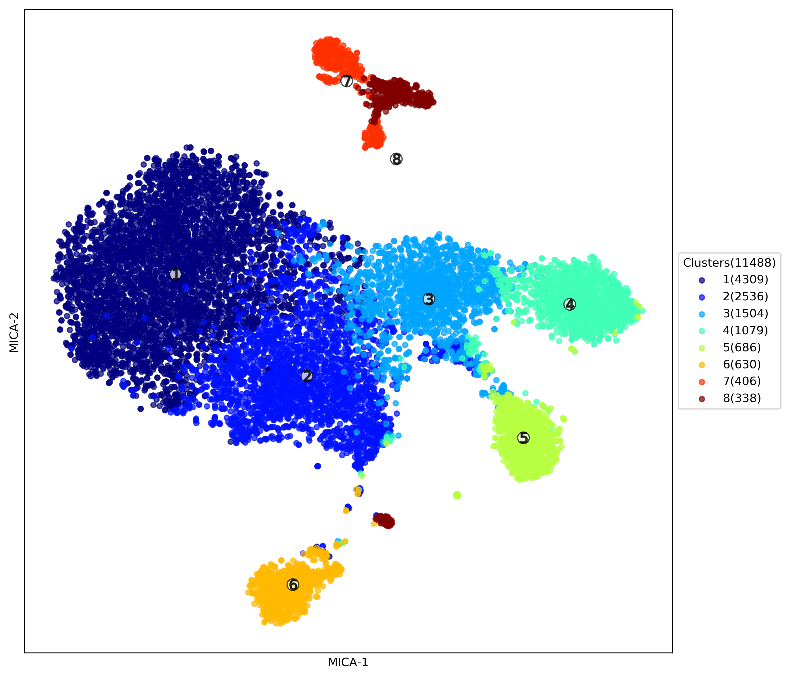

# Clustering Analysis with MICA on LSF
{:.no_toc}
MICA(Mutual Information based Clustering Analysis) is a nonlinear clustering analysis tool designed for scRNA-seq data. To install MIE (Mutual inforamtion estimator for distance matrix generation, module required for MICA) and MICA, please refer our [MIE](https://github.com/jyyulab/MIE) and [MICA](https://github.com/jyyulab/MICA) github page.  
{: .fs-6 .fw-300 }

## Table of contents
{: .no_toc .text-delta }

1. TOC
{:toc}

---
## Preprocssing
Preprocessing is very simple for MICA analysis. You can use our customized script in R, with function 'pre.MICA'

```R
require(scMINER)
d <- pre.MICA (data.input = [your_data], #data matrix that have unique colnames and geneSymbol as rownames
               output_rmd = TRUE, #whether or not output Rmarkdown report, default as TRUE
               projectName = "PBMC12K", 
               plot.dir = ".", # save plot at..
               sampleID = "Sample", # sample info (could be a string or a vector of original group info))

```
## Basic usage
MICA is implemented in python, in order to run MICA troublefree, you could use function 'generate_MICA_rmd' in R package scMINER to generate essential command for running MICA on LSF via:

```R
generateMICAcmd<-function(save_sh_at, #path to save shell script 
                            input_file, #your MICA input file
                            project_name, 
                            num_cluster, #a vector of numerical number
                            output_path, 
                            host="lsf", #or local
                            queue=NULL, #your queue to submit the job
                            memory=NULL, #specify if you use LSF, a vector of 4 numerical number
                            dim_reduction_method="MDS", 
                            visualization="tsne")
```

or, you can edit create your own shell script to run MICA like below: 

```SHELL
#!/usr/bin/env bash
mica LSF \
-i ./test_data/inputs/PBMC_Demo_MICA_input_mini.txt \
-p "test_local" \
-k 3 4 \
-o ./test_data/outputs/test_local/ \
```

## MICA Outputs

Each assigned number of k will output one folder containing following files.

    

1. `[Project_name]_k[number]_tsne.png`  --visualization of clustering result (default as UMAP)
2. `[Project_name]_dist.h5`  -- h5 file containing distance matrix calculated.
3. `[Project_name]_mds.pdf`  -- pdf file of t-SNE visualization of mds transformed distance matrix, with perplexity set to 30
4. `[Project_name]_tsne_ClusterMem.txt`  -- txt file containing visualization coordinates and clustering labels


## Useful parameters

### Visualize with U-map or t-SNE
MICA incorporate [UMAP](https://umap-learn.readthedocs.io/en/latest/parameters.html) as optional clustering visualization, with `min_dist` parameter set to `0.25`, this controls how points packed together. Low values of min_dist will result in clumpier embeddings. You can tune this parameter with :

```SHELL
--min_dist 0.1 (or other number ranging from 0-1) 
```

tSNE visualization is our default visualization method in the pipeline, if you want to use t-SNE, just set :

```SHELL
--visualization tsne (all lower cap, no "-")
```
and you can also set parameter (perplexity) for tsne using

```SHELL
-pp 20 (or any other integers larger than 5)
```

### Try other dimension reduction methods
MICA also incorporated other dimension reduction methods such as pca or lpl, 
you can use them via adding parameter:

```SHELL
-dr PCA  (or: MDS | PCA | LPL | LPCA) 
```

### Try other distance matrix calculation methods
MICA also incorporated other dimension reduction methods such as pca or lpl, 
you can use them via adding parameter:

```SHELL
--dist MI  (or: euclidean | spearman | pearson)
```

