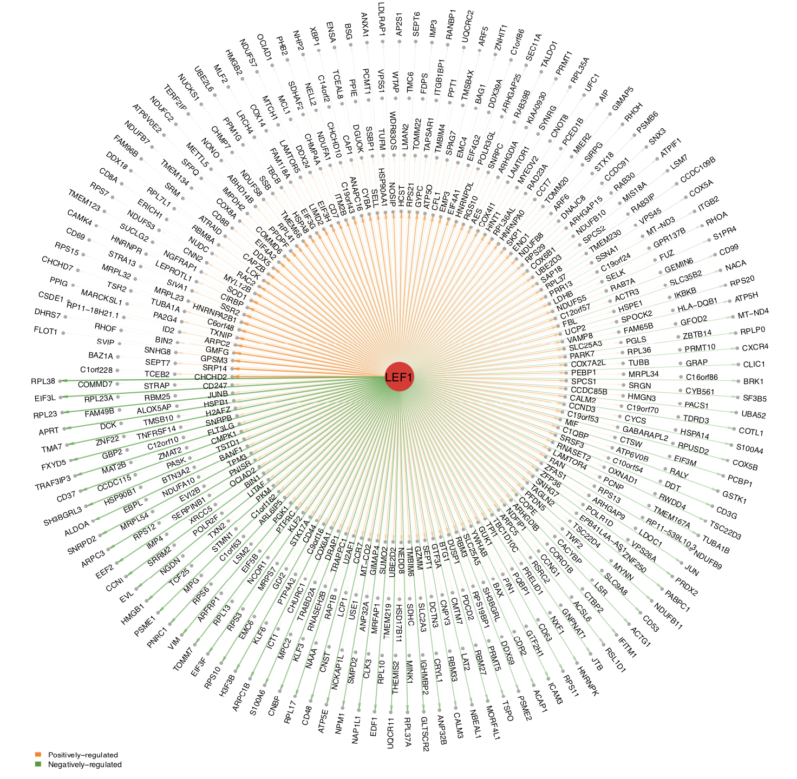
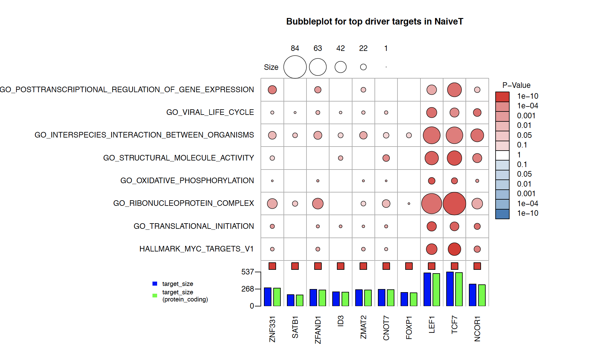

# Advanced analysis
{:.no_toc}
Here we demonstrate our advanced downstream analysis pipeline using PBMC (10x genmomics) scRNA-seq data after following driver estimation tutorial under tab `step by step user guide`

## Network visualization
scMINER incorporates a handful of network visualization/exploration function adapted from [NetBID2](https://jyyulab.github.io/NetBID/), a powerful tool for data-driven network-based bayesian Inference of drivers. scMINER also offered several wrappers of basic visualization functions in NetBID2 for better usability. 

### Single network visualization
In scMINER, you can visualize your driver and its targets by function `draw.network`. It was adapted from function `draw.targetNet` and `draw.targetNet.TWO` from `NetBID2`. This function can help visualize a driver's targets as well as the relationship(edge) between source and target genes, by taking Mutual information as edge weight, and spearman correlation as direction.

```R
draw.network(net1 = net,src1 = "LEF1", #driver name
	ifSymbol = TRUE, #if your source driver name is a Symbol 
	ifWeighted = TRUE, #if plot edge with weight and direction
	pdf_name = "LEF1.TF_in_NaiveT_network.pdf",
	n_layer=4)

```
<center></center>


### Subnetwork structure visualization between two networks
You can also use `draw.network` function to visualize two networks and their subnetwork structure. This could be used for: 
- Identify common targets from two top driver from the same network
- Identify network rewiring event of same driver in different cell type network.   


Here below is an example for later case:

```R
draw.network(net1 = net1,net2 = net2,
		src1 = "BATF",src2="BATF", 
		source1_z=-3, source2_z=4,
		ifSymbol = TRUE,ifWeighted = TRUE,
		pdf_name = "BATF.TF_in_2_network.pdf",
		n_layer=4)
```
<center></center>


## Biological function anlaysis for drivers 

### Gene set overlap with targets visualized by bubble plot
When picking candidate hidden drivers, it would be extremly helpful if we could identify the potential biological pathways this driver regulates. With SJARACNe infered network, we can assess as well as  visualizethe overlap between knowledge-based gene sets and driver's targets via function `draw.bubblePlot`. This function returns a bubble plot indiating results from Fisher exact test. 

Before using`draw.bubblePlot` function, you have to load genesets in your working environment by function `gs.preload()`

```R
gs.preload(use_spe='Homo sapiens',update=FALSE)
```

Then you can use function `TopMasterRegulator` to pull out top hidden driver candidates from your Differential activity analysis results. Or write your own fucntions to hand pick candidate to visualize. Here we provide an example of using function `TopMasterRegulator`.

```R 
TF_list <- TopMasterRegulator(DAG_result = DAG_result,
                              celltype="NaiveT",
                              n = 10, degree_filter = c(50,800))
```
Next generate your ID to symbol conversion table, since all gene sets are curated at gene symbol level. Here in our data, we used ensembl_id as our default ID for network construction. In order to match your ID with gene symbols, you can use function: 

```R
tbl <- get_IDtransfer2symbol2type(from_type = "ensembl_gene_id",
		use_genes = rownames(eset.12k),ignore_version = TRUE)
```

Here we provide an example for ploting out overlap between target list of top drivers in Naive T cells, and knowledge based gene sets from "Hallmark","KEGG" and "GO".

```R
draw.bubblePlot(driver_list= TF_list,
                show_label=DAG_result[TF_list,"geneSymbol"],
                Z_val=DAG_result[TF_list,"Z_NaiveT"],
                driver_type=NULL,
                target_list=net1$target_list,
                transfer2symbol2type=tbl,
                bg_list=fData(eset.12k)$geneSymbol,
                min_gs_size=50,max_gs_size=600, 
                top_geneset_number=8,top_driver_number=10,use_gs = c("H","C5","CP:KEGG"),
                pdf_file = 'NaiveT_bubblePlot.pdf',
                main='Bubbleplot for top driver targets in NaiveT')

```

<center></center>


---
```
## R session info


R version 3.5.0 (2018-04-23)
Platform: x86_64-apple-darwin15.6.0 (64-bit)
Running under: macOS High Sierra 10.13.6

Matrix products: default
BLAS: /System/Library/Frameworks/Accelerate.framework/Versions/A/Frameworks/vecLib.framework/Versions/A/libBLAS.dylib
LAPACK: /Library/Frameworks/R.framework/Versions/3.5/Resources/lib/libRlapack.dylib

locale:
[1] en_US.UTF-8/en_US.UTF-8/en_US.UTF-8/C/en_US.UTF-8/en_US.UTF-8

attached base packages:
[1] parallel  stats     graphics  grDevices utils     datasets  methods   base     

other attached packages:
[1] bindrcpp_0.2.2      Biobase_2.42.0      BiocGenerics_0.28.0 dplyr_0.7.8        
[5] RColorBrewer_1.1-2  ggplot2_3.1.0       reshape2_1.4.3     

loaded via a namespace (and not attached):
 [1] Rcpp_1.0.0       rstudioapi_0.8   bindr_0.1.1      magrittr_1.5     tidyselect_0.2.5
 [6] munsell_0.5.0    colorspace_1.3-2 R6_2.3.0         rlang_0.3.0.1    stringr_1.3.1   
[11] plyr_1.8.4       tools_3.5.0      grid_3.5.0       gtable_0.2.0     withr_2.1.2     
[16] digest_0.6.18    yaml_2.2.0       lazyeval_0.2.1   assertthat_0.2.0 tibble_1.4.2    
[21] crayon_1.3.4     zip_1.0.0        purrr_0.2.5      glue_1.3.0       labeling_0.3    
[26] openxlsx_4.1.0   stringi_1.2.4    compiler_3.5.0   pillar_1.3.1     scales_1.0.0    
[31] pkgconfig_2.0.2 
```
---
