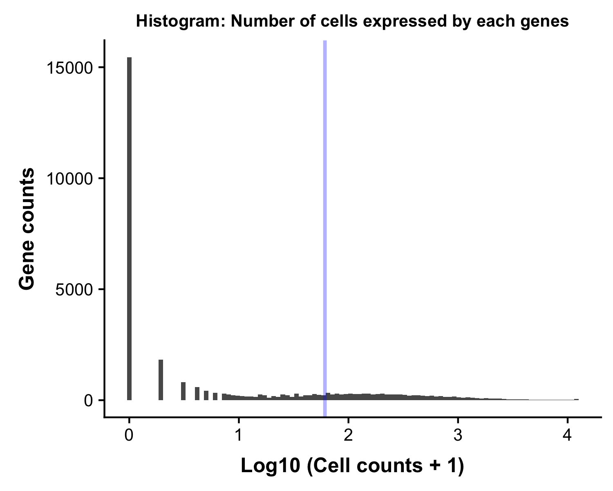
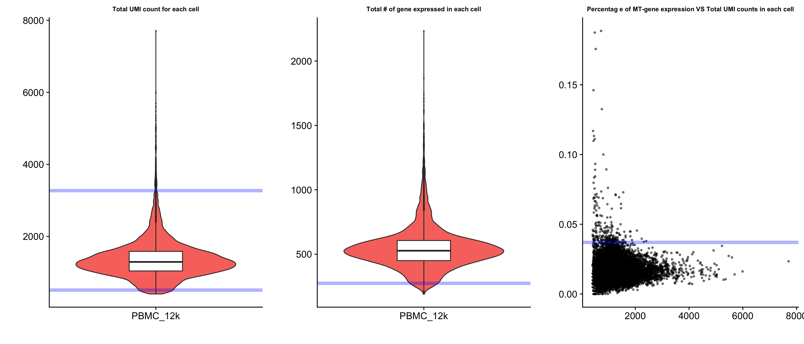
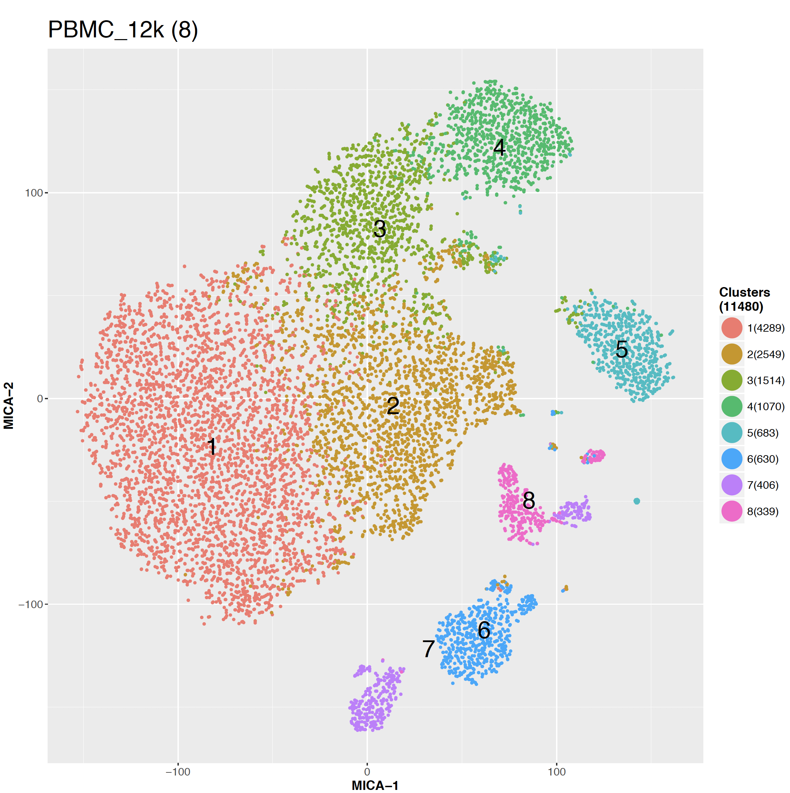
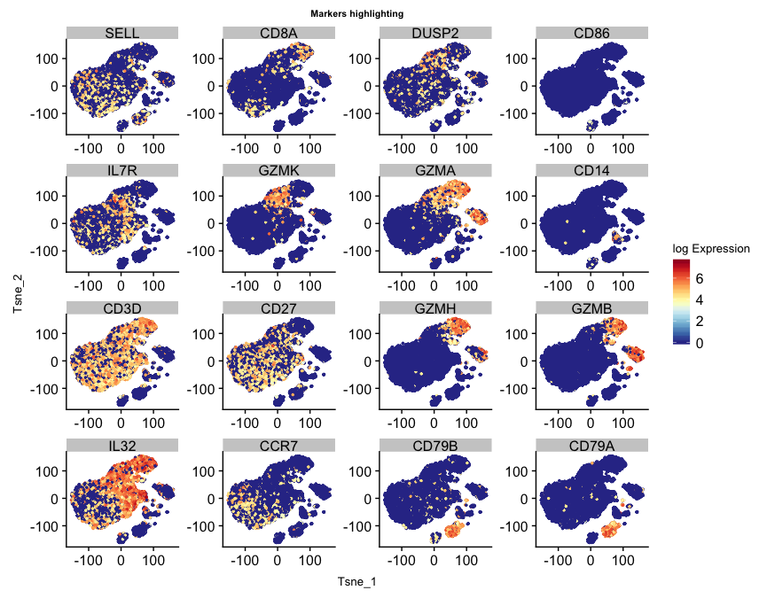
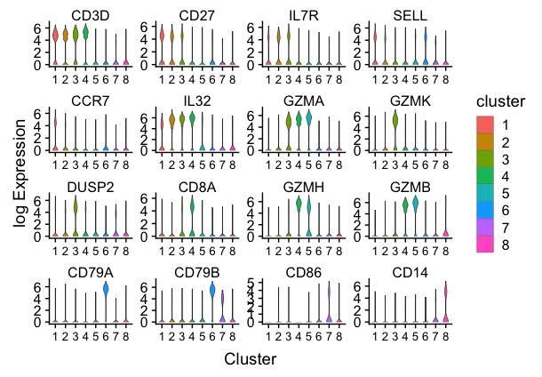
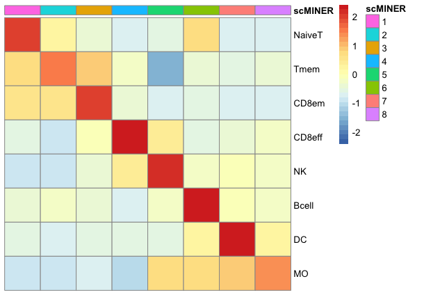

# Analysis on PBMC(12k) scRNA-seq data via scMINER
{:.no_toc}
Here we demonstrate our pipeline using PBMC (10x genmomics) scRNA-seq data [link to data matrix]. Full data contains 68k cells(link to 10x website), in order to provide a quicker guidance, we've down sampled this data to 12k cells.
Original data website can be downloaded [here](https://support.10xgenomics.com/single-cell-gene-expression/datasets/1.1.0/fresh_68k_pbmc_donor_a).


## Table of contents
{: .no_toc .text-delta }

1. TOC
{:toc}

---
## Installation


## Data preprocessing
This can be done by any scRNA-seq preprocessing pipeline. We encourage user to feed in all genes from your data for MICA, instead of highly variable genes only. Here, in order to stick to the focus, we only demonstrate a quick function to conduct gene/cell filtering, without any data exploratory visualization.

### Read 10x genomics data
Read 10x genomics data wih function embeded in MINIE package.

```R
d <- readscRNAseqData(file="PBMC68k_input/",is.10x = TRUE)
```

### Down sampling
In order to provide a quicker guidance, we've down sampled this data to 12k cells.

```R
set.seed(1)
d.12k<-d[,sample(colnames(d),12000)]
dim(d.12k) #[1] 32738 12000
```	


### Quality control
```R
d <- pre.MICA (data.input=d.12k, #data matrix that have unique colnames and geneSymbol as rownames
                     gene_filter=TRUE, # do gene filtering
                     cell_filter=TRUE, # do cell filtering
                     cell_percentage=0.005, # gene filtering criteria
                     ERCC_filter=TRUE, # by spike-in
                     Mito_filter=TRUE, # by mitochondra genes
                     UMI_filter="both", # by UMI count(three way filtering)
                     plotting=TRUE, # If do visualization 
                     plot.dir=".", # save plot at..
                     norm=10e6, # normalize to ..
                     sampleID="PBMC_12k", # sample info
                     log2Transform=TRUE #if or not do log2 transformation
                     )
```

If you set `plotting = TRUE`, then there will be two visualization plot generated for gene/cell quality control.
One is the total number of cell expressed by each gene




The other plot will visualize total UMI count, total number of gene expressed, mitochondria percentage, and spike-in percentage for each cell.




### Generate MICA input
After reviewing all visualization and conduct filtering, you can go ahead and generate MICA input, which will be a cell by gene txt file. If your data was not generated by 10x genomics, you can prepare your own filtering and use this step for MICA Input generation, please note that you should always feed MICA the log or log2 transformed data.

```R
generateMICAinput(data=d,filename="PBMC12k_MICA_input.txt")
```
This will output a txt file containing correct information for MICA.

## Run MICA clustering on HPCF

MICA is implemented in Python now. If you would like to install MICA solely, please infer [MICA github page](https://github.com/jyyulab/MICA).There are several parameters for you to choose when running MICA.
Here we provided is an example of running MICA on high performance clusters.

In shell terminal, for environmental set up:

```shell 
ssh hpc                             # ssh to a head node
hpcf_interactive                    # login an interactive node
setcbenv prod                       # set CompBio environment to prod
cbload phoenix                      # load CompBio modules
cbload util-python

module load python/3.6.1            # load python for clustering
module load R/3.4.0                 # load R for visualization
```

To run MICA:  

```shell
./MIE/mie.py Pipeline test_no_intall_LSF ./test_data/inputs/PBMC_Demo_MICA_input_mini.txt ./test_data/outputs/ \
test_no_intall_LSF --host LSF       # run MIE

./MICA/mica.py Clust PBMC_12k ./PBMC_12k/inputs/PBMC_12k.whole.h5 ./test_data/inputs/PBMC_12k_mi.h5 ./PBMC_12k/outputs/ PBMC_12k --k 7 8 9 10 --perplexity 30 --retransformation False 
--host LSF
```

This will give you one t-SNE visualization for each choice of k.




## Install MINIE package in R for cluster-based network analysis
{: .d-inline-block :}

**MINIE** analysis was wrapped up as a R package to help bridge unsupervised clustering and gene regulatory network analysis.  

> **_Note:_** Detailed information about individual functions are documented in package manual.


## Cell type analysis from MICA output
{: .d-inline-block :}

First, after clustering via MICA(see [MICA] ({{site.baseurl}}), you can load MICA output (in .txt) as well as input expression matrix in R under an expressionSet. This is going to be the major data structure we used for MINIE analysis in R.

### Reading MICA output
{: no_toc }

```R
eset.demo <- readMICAoutput( 
	input_file="PBMC12k_MICA_input.txt",
	load_clust_label=TRUE, 
	output_file="PBMC12k.ggplot.txt")
```


### Marker gene highlighting
{: no_toc }

Picked marker genes could be visualized on t-SNE scatterplot, heatmap or violinplot. This will help pick up a reasonable number of cluster.

```R
gn.sel<-c("CD3D","CD27","IL7R","SELL","CCR7","IL32","GZMA",
          "GZMK","DUSP2","CD8A","GZMH","GZMB","CD79A","CD79B","CD86","CD14")
gene_highlighting(input_eset=eset.demo, target = gn.sel, title.size = 8)
```




```R
gene_vlnplot(eset.demo,target=gn.sel,group_tag = "label")
```





```R
gene_heatmap(eset = eset.demo,target = gn.sel,group_tag = "label",
			 save_plot = TRUE,width = 6,height = 6,
             name = "log2_expression",plot_name="./GeneHeatmap.png")
```


### Assign cell type to cluster
{: no_toc }

Here we curated a reference signature list of 8 immune cell types(link) for cell type annotation. In `AssignCellTypes.hmp` function, we calculated cell type scores for each clusters, and visualize scores using heatmap. 

```R
ref<-read.xlsx("Immune_signatures.xlsx")
head(ref)
```
```R
> head(ref)
  celltype markers weight
1   NaiveT    SELL      1
2   NaiveT    CCR7      1
3     Tmem    IL7R      1
4     Tmem    CD27      1
5     Tmem    IL32      1
6     Tmem    GZMA     -1

```

```R
hmp<-AssignCellTypes.Hmp(ref=ref,eset=eset.demo,save_plot = TRUE)

# Manually assign your cell type label
celltype <-c("NaiveT","Tmem","CD8em","CD8eff","NK","Bcell","DC","Mo")
eset.demo$celltype <- celltype[eset.demo$label]
```



## Network generation via SJARACNe
{: no_toc }

In order to generate cell type/group/cluster specific network, group information should be stored under `pData([your_expressionSet])`. And R function `generateSJAracneInput` will help to partition your expression matrix and conduct a loose filtering of your scRNA-seq data(filter about 0 expressed genes in cluster). Besides, a reference TF list should be provided as `tf.ref` to guide hub gene selection. Each group will create one directory which contains filtered expression matrix in .exp format, as long as the filtered TF list in .txt. 

```R
generateSJAracneInput(eset=eset.demo,tf.ref=tf.ref,wd.src="Sjaracne/", group_tag="celltype")
```
_Warning:_ SJARACNe has not been integrated into MINIE yet, please consult [here](https://github.com/jyyulab/SJARACNe) to run SJARACNe for network generation on scRNA-seq data.


## Find cell type specific master regulator 
{: no_toc }

Identify master regulator from content based network is the key step in MINIE to help understanding your scRNA-seq data.  


### Calculate Inferred activity
{: no_toc }
TF acitivities are calculated by integrating expression profile of their targets. Targets identified from SJARACNe of perticular TF was normalized and averaged to infer TF activity.

```R
acs.demo <- GetActivityFromSJARANCE(
			 SJaracne_output_path="Sjaracne/",
			 SJaracne_input_eset=eset.demo,
			 activity.method="unweighted", 
			 activity.norm=TRUE, 
			 group_tag = "celltype",
			 save_network_file=FALSE, save_path=NA)
```


### Find Differential activity TF
{: no_toc }

The function `FindDAG` was designed for identify highly differentiated TF from SJARACNe inferred activity matrix. In order to do so, we did two sided student's t-test to compare mean acitivty from one cell type V.S. the others. 

```R
res <- FindDAG(eset = acs.demo,group_tag = "celltype")

```
This function will output a full matrix that contians all TF occurred in original dataset, statistics such as t.statistics, p-value, 95%CI, etc. are outputed to help idenify master regulators. 

```R


```

You can also visualize top master regulator candidates in heatmap or violinplots. Only png as plotting device is supported.

```R
gn.sel <- TopMasterRegulator(res)
```

```R
gene_heatmap(eset = eset.demo,target = gn.sel,group_tag = "label",
			 width = 6,height = 6, save_plot=TRUE,
             name = "Activity",plot_name="./TopTFHeatmap.png")
```


```

---
## R session info


R version 3.5.0 (2018-04-23)
Platform: x86_64-apple-darwin15.6.0 (64-bit)
Running under: macOS High Sierra 10.13.6

Matrix products: default
BLAS: /System/Library/Frameworks/Accelerate.framework/Versions/A/Frameworks/vecLib.framework/Versions/A/libBLAS.dylib
LAPACK: /Library/Frameworks/R.framework/Versions/3.5/Resources/lib/libRlapack.dylib

locale:
[1] en_US.UTF-8/en_US.UTF-8/en_US.UTF-8/C/en_US.UTF-8/en_US.UTF-8

attached base packages:
[1] parallel  stats     graphics  grDevices utils     datasets  methods   base     

other attached packages:
[1] bindrcpp_0.2.2      Biobase_2.42.0      BiocGenerics_0.28.0 dplyr_0.7.8        
[5] RColorBrewer_1.1-2  ggplot2_3.1.0       reshape2_1.4.3     

loaded via a namespace (and not attached):
 [1] Rcpp_1.0.0       rstudioapi_0.8   bindr_0.1.1      magrittr_1.5     tidyselect_0.2.5
 [6] munsell_0.5.0    colorspace_1.3-2 R6_2.3.0         rlang_0.3.0.1    stringr_1.3.1   
[11] plyr_1.8.4       tools_3.5.0      grid_3.5.0       gtable_0.2.0     withr_2.1.2     
[16] digest_0.6.18    yaml_2.2.0       lazyeval_0.2.1   assertthat_0.2.0 tibble_1.4.2    
[21] crayon_1.3.4     zip_1.0.0        purrr_0.2.5      glue_1.3.0       labeling_0.3    
[26] openxlsx_4.1.0   stringi_1.2.4    compiler_3.5.0   pillar_1.3.1     scales_1.0.0    
[31] pkgconfig_2.0.2 
```
---
