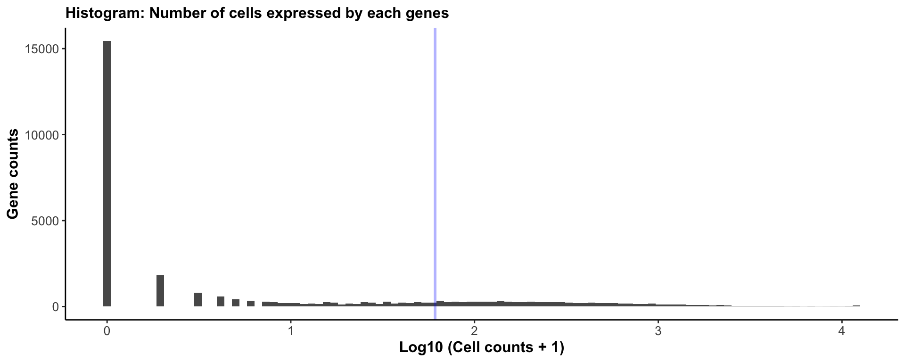
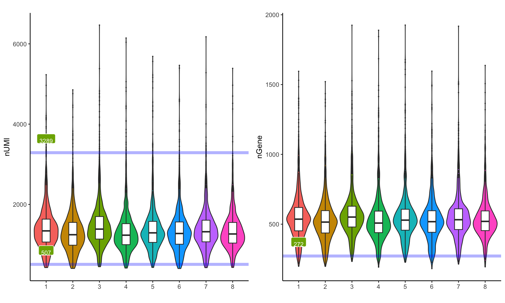
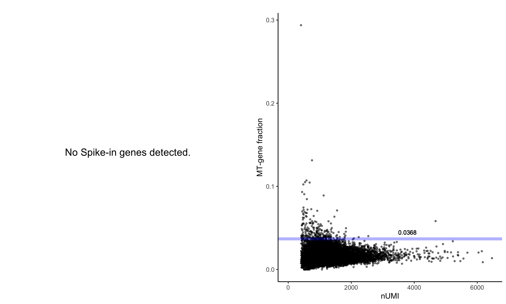
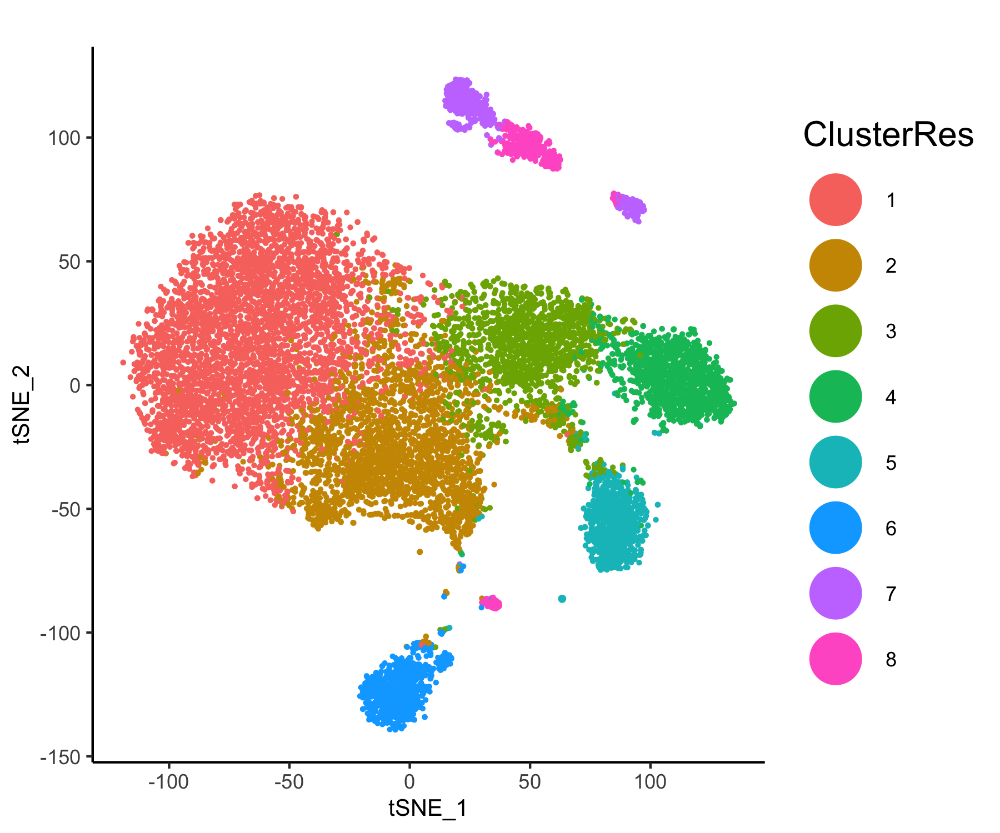
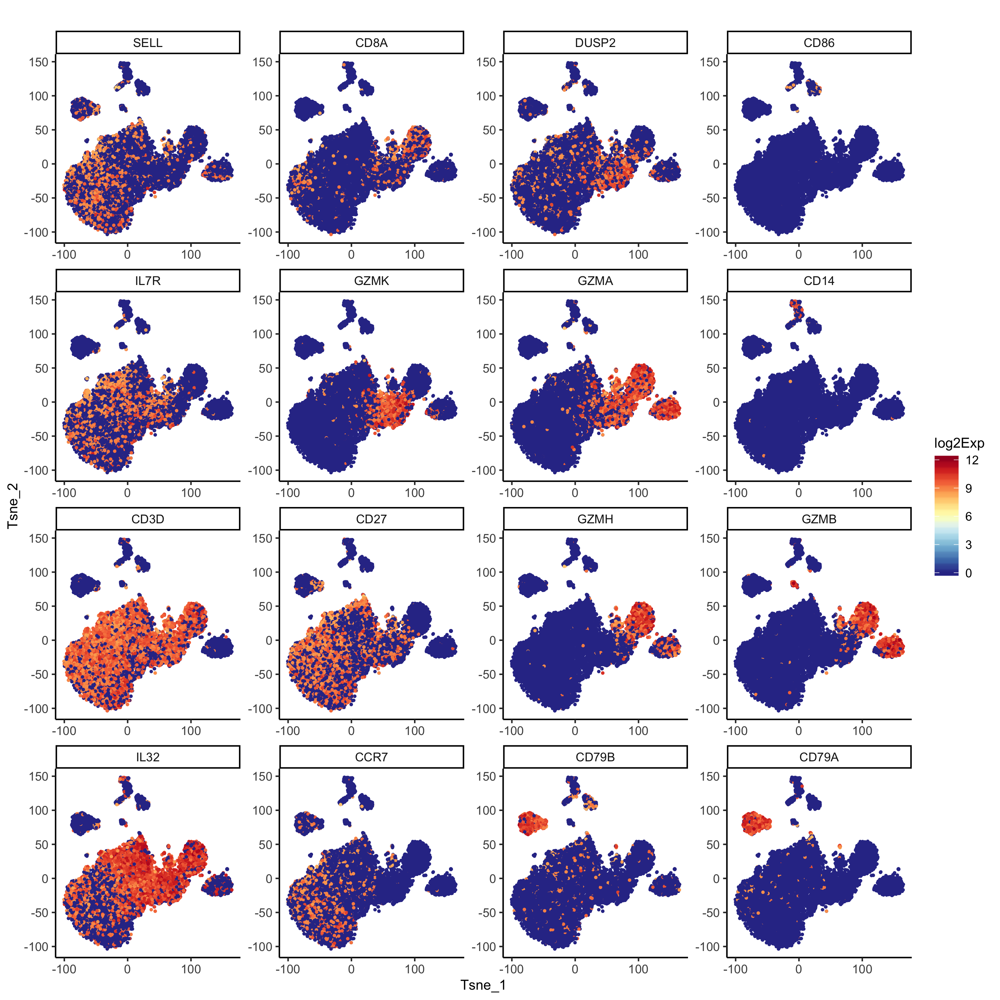
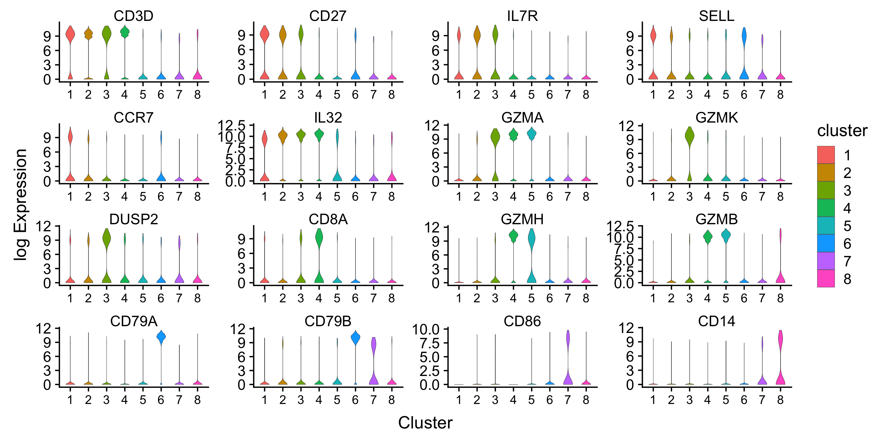
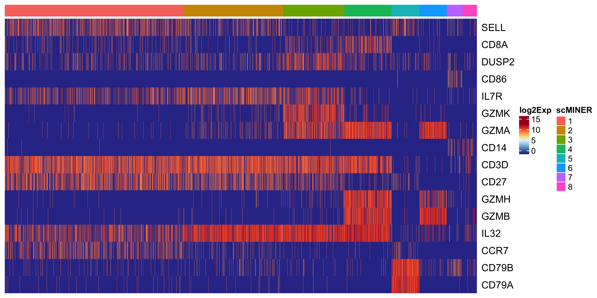
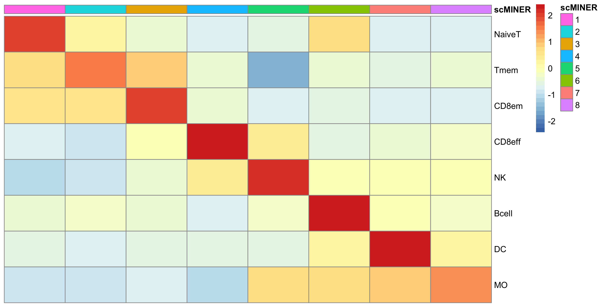
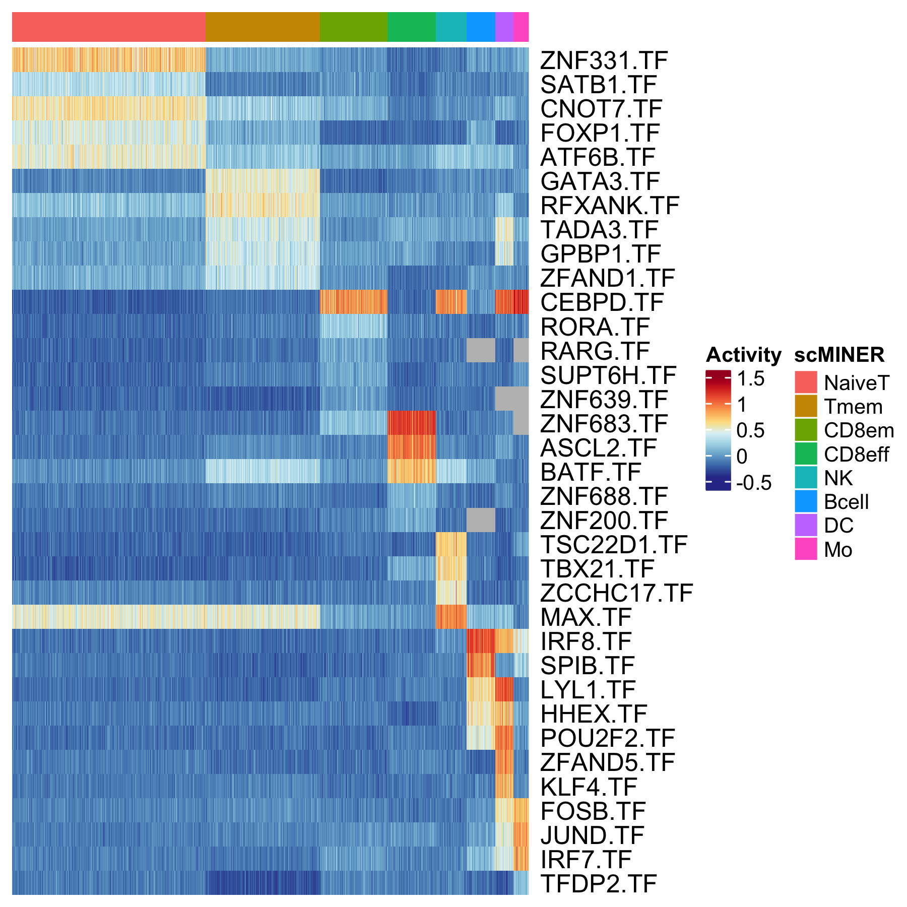
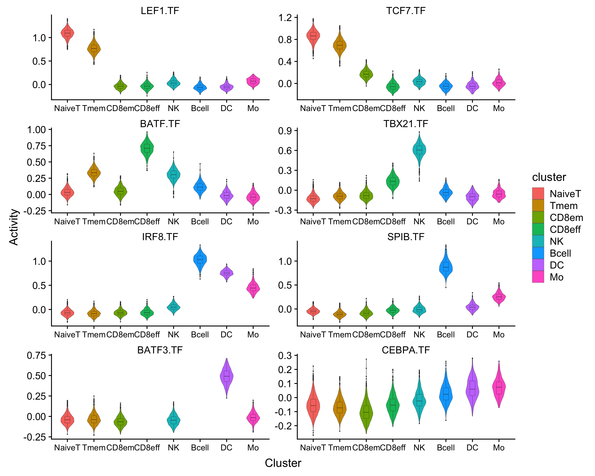

# Analysis on PBMC(12k) scRNA-seq data via scMINER
{:.no_toc}
Here we demonstrate our pipeline using PBMC (10x genmomics) scRNA-seq data [link to data matrix]. Full data contains 68k cells(link to 10x website), in order to provide a quicker guidance, we've down sampled this data to 12k cells.
Original data website can be downloaded [here](https://support.10xgenomics.com/single-cell-gene-expression/datasets/1.1.0/fresh_68k_pbmc_donor_a).


## Table of contents
{: .no_toc .text-delta }

1. TOC
{:toc}

---
## Installation

scMINER is based on python and R, with a single R package glued all essential functions together.


## scRNA-seq data preprocessing
This can be done by any scRNA-seq preprocessing pipeline. We encourage user to feed in all genes from your data for MICA, instead of highly variable genes only. Here, in order to stick to the focus, we only demonstrate a quick function to conduct gene/cell filtering, without any data exploratory visualization.

### Read 10x genomics data
Read 10x genomics data wih function embeded in scMINER package. This function could help read either 10x genomics standard output, as well as other text files types by passing arguments to `read.delim()`. If set `CreateSparseEset=T` This will help create a Sparse matrix object using Expressionset prototype, otherwise, it will create a list Object that stores expression data, feature data and sample data in different slots. If `add.meta=T`, then corresponding sample info such as total number of UMI will be calcualated and outputed.

```R
d <- d.68k <- readscRNAseqData(file="../PBMC68k_input/",is.10x = TRUE,CreateSparseEset = F, add.meta=F)
```

### Down sampling
In order to provide a quicker guidance, we've down sampled this data to 12k cells.

```R
set.seed(1)
d.12k<-d[,sample(colnames(d),12000)]
dim(d.12k) #[1] 32738 12000
```
You can also create Sparse Matrix expression by using `CreateSparseEset`function:

```R
eset.12k<-CreateSparseEset(data=d.12k,feature.data = d.68k$feature.data,add.meta = T)
```

### Quality control and data filtering
Quality control assessments could be done using `draw.scRNAseq.QC` step, this will output a Rmarkdown generated report, including essential figures for at both gene and cell level. Suggested cutoff will be returned as a list if `output.cutoff` was set to be `TRUE`. 

```R
cutoffs <- draw.scRNAseq.QC(SparseEset=eset.12k, 
                          project.name = "PBMC12k",
                          plot.dir = "./QC/",
                          group = "group",
                          output.cutoff = TRUE)
```




Second plot will visualize total UMI count, and total number of gene expressed.


Third plot will visualize mitochondria percentage, and spike-in percentage for each cell.



Then you could run cell filtering as simple as below, if feed cutoffs calculated previously from draw.scRNAseq.QC functon. You could also manually change cutoffs by reassign numbers in `cutoffs` list, e.g. set `cutoffs$umi_cf_hi<-Inf` means do not do filtering on high total UMI value.

```R
cutoffs$umi_cf_hi<-Inf #only filter on low total number of UMI
eset.sel<-preMICA.filtering(SparseEset = eset.12k,cutoffs = cutoffs)

```
 

### Normalization and transformation
In MICA, we don't provide a vriety of methods to do normalizaton, you can use your own prefered normalization method. Here we provide an example of doing CPM and log2 transformation. 

```R
norm = 1e6
exp.norm <- sweep(exprs(eset.sel), 2, norm/unname(Matrix::colSums(exprs(eset.sel))), '*')

# log transformation
exp.log2 <- log(exp.norm+1,base=2)

# save as SparseEset
eset.norm<-CreateSparseEset(data=exp.log2,meta.data = pData(eset.sel),feature.data = fData(eset.sel),add.meta = F)
```

### Generate MICA input and command
After reviewing all visualization and conduct filtering, you can go ahead and generate clustering(MICA) input, which will be a cell by gene txt file. If your data was not generated by 10x genomics, you can prepare your own filtering and use this step for clustering Input generation, please note that `you should always feed MICA the log or log2 transformed data`.

```R
generateMICAinput(data= exp.log2 ,filename="PBMC12k_MICA_input.txt")
```
This will output a txt file containing filtered expression matrix for MICA. 
We also provide a function for you to generate MICA command without writing your own scripts. If you set `host=lsf`, then you need to define `queue` required, and `memory` (optional). In `num_cluster`, you can input a vector of number of K to achieve clustering membership for different k simultaneously.

```R
generate_MICA_cmd(save_sh_at = "./PBMC12k_v3/",
                  input_file = "./PBMC12k_v3/PBMC12k_MICA_input.txt",
                  project_name = "PBMC12k",num_cluster = c(8,9,10,12,13,14,15),
                  host = "lsf", queue = [your_queue_name],
                  output_path = "./",queue = "standard")

```

## Run MICA clustering 

MICA is implemented in Python. If you would like to install MICA, please infer [MICA github page](https://github.com/jyyulab/MICA).There are several parameters for you to choose when running MICA. A more comprehensive tutorial could be found [here for local](./MICA.md) and [here for lsf](./MICA_LSF.md).Here recommend save your working directory before running MICA. 


## Cell type analysis from MICA output
{: .d-inline-block :}

First, after clustering via MICA(see [MICA] ({{site.baseurl}}), you can load MICA output (in .txt) as well as input expression matrix in R under an `expressionSet`. This is going to be the major data structure we used for downstream analysis in R.

### Reading MICA output
{: no_toc }
You can start with one MICA membership and study your optimal number of cluster with cell type specific markers.

```R
eset.12k <- readMICAoutput(Obj = d.sel,load_clust_label = TRUE, 
output_file = "MICA/PBMC12k_k8_tsne_ClusterMem.txt")

```

To visualize MICA label or other metadata, you can use function `MICAplot`.

```R
MICAplot(input_eset = eset.12k,visualize = 'tSNE',X = "X",Y="Y",label = "label",pct = 0.5)

```


### Marker gene highlighting
{: no_toc }

Picked marker genes could be visualized on t-SNE scatterplot, heatmap or violinplot. This will help pick up a reasonable number of cluster.

```R
gn.sel<-c("CD3D","CD27","IL7R","SELL","CCR7","IL32","GZMA",
          "GZMK","DUSP2","CD8A","GZMH","GZMB","CD79A","CD79B","CD86","CD14")

p <- feature_highlighting(input_eset = eset.12k,target = gn.sel,ylabel = "log2Exp", x="X",y="Y",title.size = 12)

```



```R
p <- feature_vlnplot(eset.12k,target=gn.sel,feature = "geneSymbol",
group_tag = "label",ncol = 4,ylabel = "log2Exp")
```



```R
feature_heatmap(eset = eset.12k,target = gn.sel,group_tag = "label",
			 save_plot = TRUE,width = 6,height = 6,
             name = "log2_expression",plot_name="./GeneHeatmap.png")
```




### Assign cell type to cluster
{: no_toc }

Here we curated a reference signature list of 8 immune cell types(link) for cell type annotation. In `marker_bbplot` function, we calculated cell type scores for each clusters, and visualize scores using heatmap. 

```R
ref<-read.xlsx("Immune_signatures.xlsx")
head(ref)
> head(ref)
  celltype markers weight
1   NaiveT    SELL      1
2   NaiveT    CCR7      1
3     Tmem    IL7R      1
4     Tmem    CD27      1
5     Tmem    IL32      1
6     Tmem    GZMA     -1

p<-marker_bbplot(ref=ref,eset=eset.12k)

```


We recommend assign your celltype as factors in your expression set.

```R
indx<-factor(x=c("NaiveT","Tmem","CD8em","CD8eff","Bcell","NK","DC","Mo"),
				levels=c("NaiveT","Tmem","CD8em","CD8eff","Bcell","NK","DC","Mo"))
eset.12k$celltype <- indx[eset.12k$label]
```


## Network generation via SJARACNe
{: no_toc }

In order to generate cell type/group/cluster specific network, group information should be stored under `pData([your_expressionSet])`. And R function `generateSJAracneInput` will help to partition your expression matrix and conduct a loose filtering of your scRNA-seq data(filter about 0 expressed genes in cluster). Besides, a reference TF list should be provided as `tf.ref` to guide hub gene selection. Each group will create one directory which contains filtered expression matrix in .exp format, as long as the filtered TF list in .txt. 

```R
generateSJAracneInput(eset=eset.12k,tf.ref=tf.ref,wd.src="Sjaracne/", group_tag="celltype")
```

_Warning:_ SJARACNe has not been integrated into scMINER yet, please consult [here](https://github.com/jyyulab/SJARACNe) for installation and basic usage. Here recommend save your working directory before running SJARACNe. 


```shell
indir=~/PBMC12K/SJARACNE_PBMC12K/

for i in $(ls -d */ | cut -f1 -d'/');do
sjaracne ${i} $indir/${i}/*.exp $indir/${i}/tf/*.txt $indir/${i}/tf/ --c_threshold 0.01;
echo ${i} has been submitted!;
done

```


## Find cell type specific master regulator 
{: no_toc }

Identify master regulator from content based network is the key step in scMINER to help understanding your scRNA-seq data.  


### Calculate Inferred activity
{: no_toc }
TF acitivities are calculated by integrating expression profile of their targets. Targets identified from SJARACNe of perticular TF was normalized and averaged to infer TF activity.

```R
acs.12k <- GetActivityFromSJARANCE(
			 SJaracne_output_path="Sjaracne/",
			 SJaracne_input_eset=eset.demo,
			 activity.method="unweighted", 
			 activity.norm=TRUE, 
			 group_tag = "celltype",
			 save_network_file=FALSE, save_path=NA)
```


### Find Differential activity TF
{: no_toc }

The function `FindDAG` was designed for identify highly differentiated TF from SJARACNe inferred activity matrix. In order to do so, we did two sided student's t-test to compare mean acitivty from one cell type V.S. the others. 

```R
DAG_result <- FindDAG(eset = acs.demo,group_tag = "celltype")

```
This function will output a full matrix that contians all TF occurred in original dataset, statistics such as t.statistics, p-value, 95%CI, etc. are outputed to help idenify master regulators. You can save it in txt or xlsx for checking.

While you can also visualize top master regulator candidates in heatmap or violinplots. Only png as plotting device is supported.

```R
TF_list <- TopMasterRegulator(DAG_result = DAG_result,
                              celltype=levels(acs.12k$celltype), # ensure cluster order
                              n = 5, degree_filter = c(50,500))
```

```R
feature_heatmap(eset = acs.12k,target = TF_list,group_tag = "celltype",feature = "geneSymbol",
             width = 6,height = 6, save_plot=TRUE, cluster_rows = FALSE,
             name = "Activity",plot_name="./21_TopTFHeatmap.png")

```




You can also check some known master regulators as postivie control of your network analysis: 

```R
p <- feature_vlnplot(eset=acs.12k,target=c("LEF1.TF","TCF7.TF","BATF.TF","TCF7.TF","TBX21.TF",
								"IRF8.TF","SPIB.TF","BATF3.TF","CEBPA.TF"), 
					ylabel = "Activity",group_tag = "celltype",drawquantiles = FALSE, ncol = 2)
```




In order to conduct more advanced network analysis utilizing SJARACNe generated cell type specific networks, please infer 	`Cell-type spefic network analysis tab`.


---

## R session Info
```R

> sessionInfo()
R version 3.5.2 (2018-12-20)
Platform: x86_64-apple-darwin15.6.0 (64-bit)
Running under: macOS Mojave 10.14.3

Matrix products: default
BLAS: /System/Library/Frameworks/Accelerate.framework/Versions/A/Frameworks/vecLib.framework/Versions/A/libBLAS.dylib
LAPACK: /Library/Frameworks/R.framework/Versions/3.5/Resources/lib/libRlapack.dylib

locale:
[1] en_US.UTF-8/en_US.UTF-8/en_US.UTF-8/C/en_US.UTF-8/en_US.UTF-8

attached base packages:
[1] grid      parallel  stats     graphics  grDevices utils     datasets  methods   base     

other attached packages:
 [1] scMINER_0.1.0         kableExtra_1.1.0      knitr_1.24            rmarkdown_1.14        cowplot_1.0.0        
 [6] dplyr_0.8.3           pheatmap_1.0.12       ComplexHeatmap_1.20.0 scales_1.0.0          RColorBrewer_1.1-2   
[11] ggplot2_3.2.1         reshape2_1.4.3        Biobase_2.42.0        BiocGenerics_0.28.0   Matrix_1.2-17        

loaded via a namespace (and not attached):
 [1] Rcpp_1.0.2          pillar_1.4.2        compiler_3.5.2      plyr_1.8.4          tools_3.5.2         zeallot_0.1.0      
 [7] digest_0.6.20       viridisLite_0.3.0   evaluate_0.14       tibble_2.1.3        gtable_0.3.0        lattice_0.20-38    
[13] pkgconfig_2.0.2     rlang_0.4.0         rstudioapi_0.10     xfun_0.8            xml2_1.2.2          httr_1.4.1         
[19] withr_2.1.2         stringr_1.4.0       vctrs_0.2.0         hms_0.5.0           GlobalOptions_0.1.0 webshot_0.5.1      
[25] tidyselect_0.2.5    glue_1.3.1          R6_2.4.0            GetoptLong_0.1.7    readr_1.3.1         purrr_0.3.2        
[31] magrittr_1.5        backports_1.1.4     htmltools_0.3.6     rvest_0.3.4         assertthat_0.2.1    shape_1.4.4        
[37] circlize_0.4.6      colorspace_1.4-1    stringi_1.4.3       lazyeval_0.2.2      munsell_0.5.0       crayon_1.3.4       
[43] rjson_0.2.20   


```