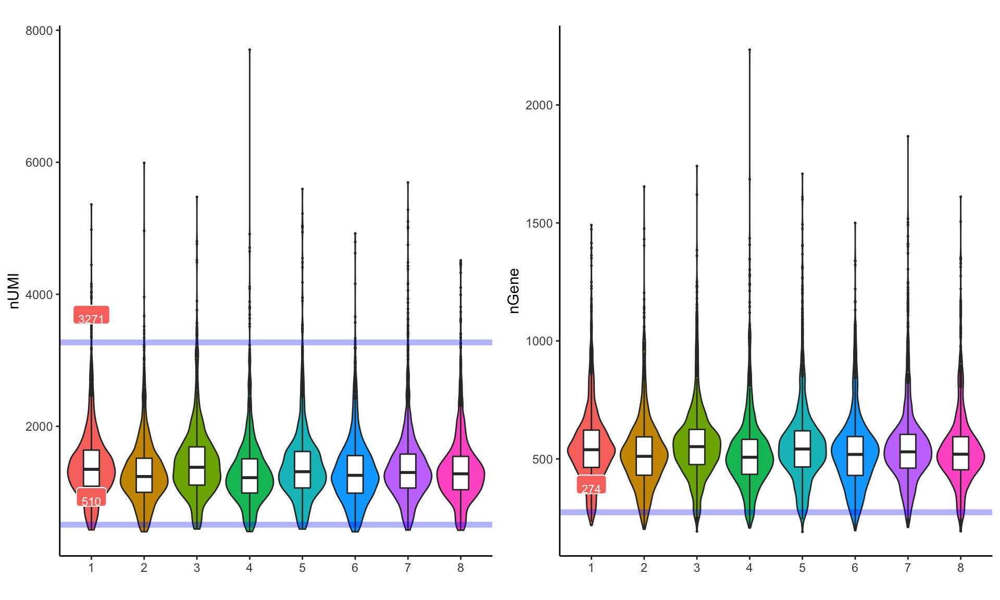
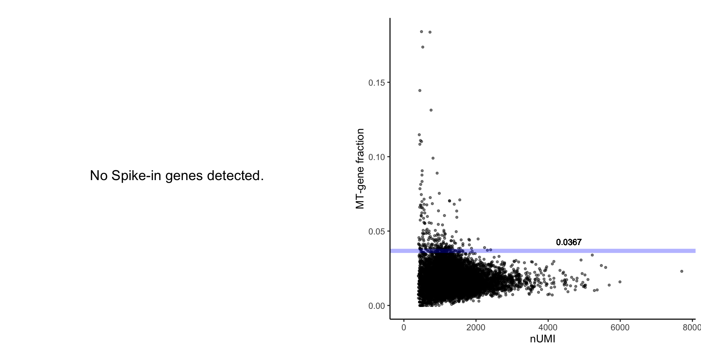
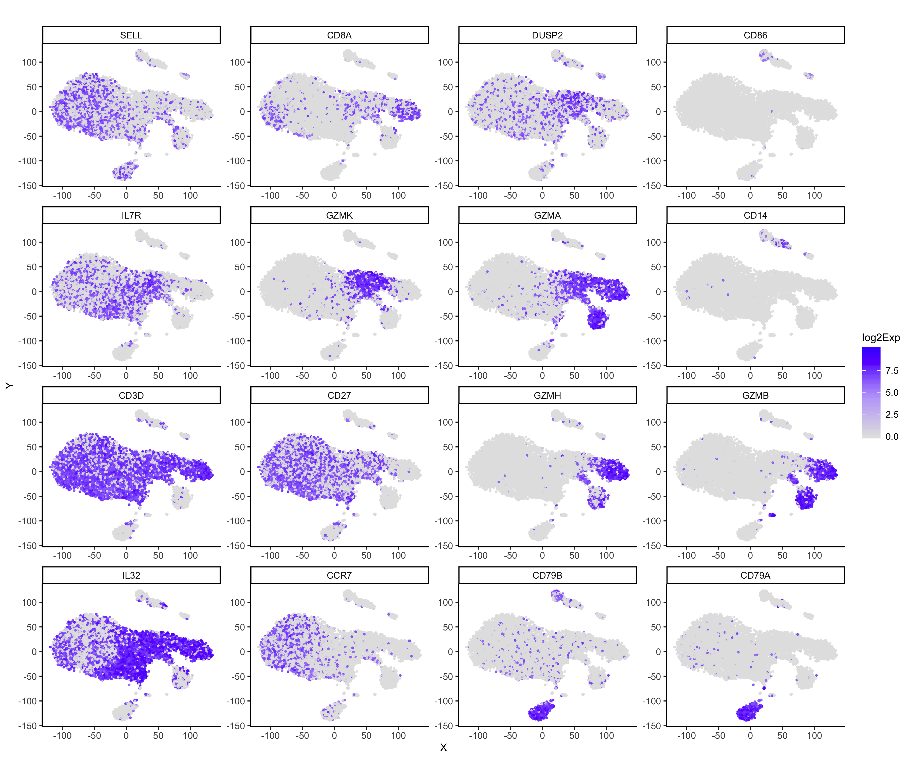
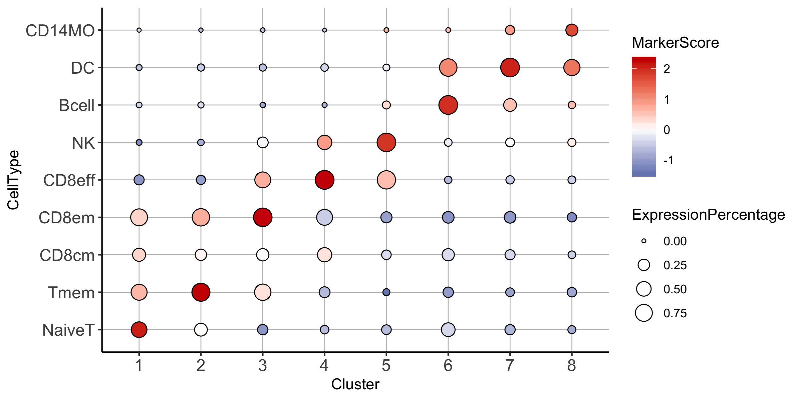
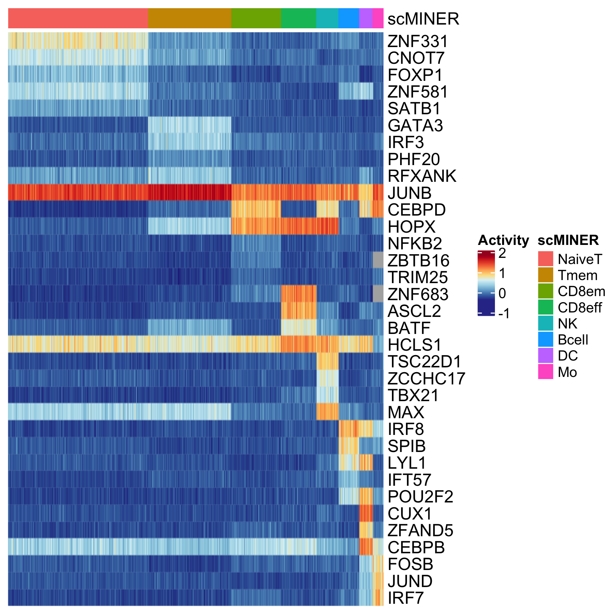
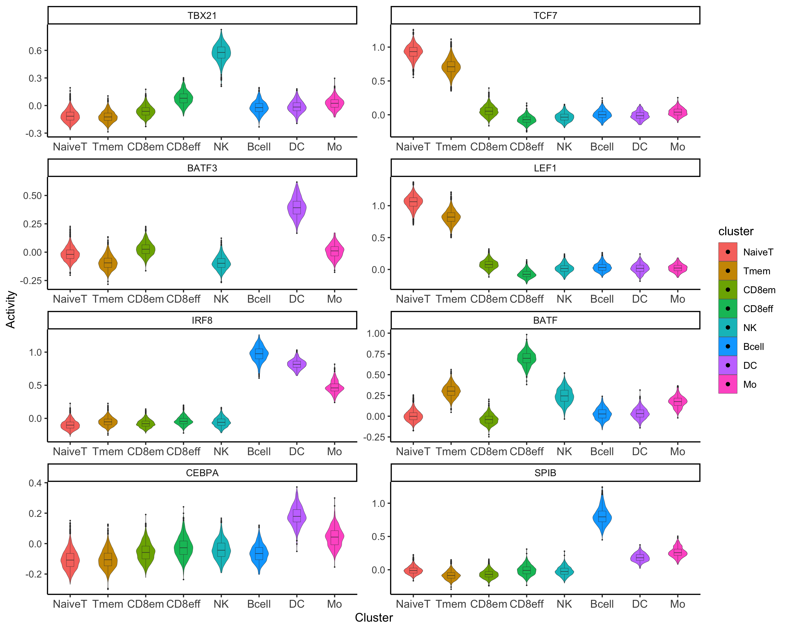

# Analysis on PBMC(12k) scRNA-seq data via scMINER
{:.no_toc}

## Table of contents
{: .no_toc .text-delta }

1. TOC
{:toc}

---
## Demo data
{: .d-inline-block :}

Here we demonstrate our pipeline using PBMC (10x genmomics) scRNA-seq data. Full data contains 68k cells, in order to provide a quicker guidance, we've down sampled this data to 12k cells.
Original data website can be downloaded [here](https://support.10xgenomics.com/single-cell-gene-expression/datasets/1.1.0/fresh_68k_pbmc_donor_a).

## Step 1: Data preprocessing
{: .d-inline-block :}

### Read 10x genomics data
Read 10x genomics data with function in scMINER package. This function could help read either 10x genomics standard output, as well as other text files types by passing arguments to `read.delim()`. If set `CreateSparseEset=T` This will help create a Sparse matrix object using Expressionset prototype, otherwise, it will create a list Object that stores expression data, feature data and sample data in different slots. If `add.meta=T`, then corresponding sample info such as total number of UMI will be calcualated and outputed. Here, since data was downsampled and not in standard 10x genomics output format, we defined `is.10x=F` and `add.meta=F`.

```R
d.12k <- readscRNAseqData(file="PBMC_demo_input.txt",is.10x = F,CreateSparseEset = FALSE, add.meta=F)
```

After confriming your data was loaded properly, you can now create Sparse Matrix expression by using `CreateSparseEset`function:

```R
eset.12k<-CreateSparseEset(data=d.12k,feature.data = d.68k$feature.data,add.meta = T)
```

### Quality control and data filtering
Quality control assessments could be done using `draw.scRNAseq.QC` step, this will output a html report generated through Rmarkdown, which includes essential figures at both gene and cell level. Suggested cutoff will be returned as a list if `output.cutoff` was set to be `TRUE`. 

```R
cutoffs <- draw.scRNAseq.QC(SparseEset=eset.12k, 
                          project.name = "PBMC12k",
                          plot.dir = "./QC/",
                          group = "group", # this indicate which meta data information will be use in x axis to group violin plots
                          output.cutoff = TRUE)
```
The first plot is a histogram which helps visualize distribution of expressed genes among each cells.
<center></center>

The second plot help visualize total UMI count, and total number of gene expressed in violin plots.


Third plot visualizes mitochondria percentage, and spike-in percentage for each cell in scatter plot.



Then you could run cell filtering with function `preMICA.filtering`, if input `cutoffs` was directly from the output of draw.scRNAseq.QC functon. You could also manually change cutoffs by re-assign thresholds in `cutoffs` list, e.g. set `cutoffs$umi_cf_hi<-Inf` means do not do filtering on outliers which have high total UMI value.

```R
cutoffs$umi_cf_hi<-Inf #only filter on low total number of UMI
eset.sel<-preMICA.filtering(SparseEset = eset.12k,cutoffs = cutoffs)
```
 
### Normalization and transformation
In scMINER package, we don't provide methods to conduct normalizaton. You can use your own prefered normalization method. However, **we highly recommend to do CPM and log2 transformation for MICA input**.

```R
norm = 1e6 
exp.norm <- sweep(exprs(eset.sel), 2, norm/unname(Matrix::colSums(exprs(eset.sel))), '*')

# log transformation
# Required for MICA
exp.log2 <- log(exp.norm+1,base=2)

# save as SparseEset
eset.norm <- CreateSparseEset(data=exp.log2,meta.data = pData(eset.sel),feature.data = fData(eset.sel),add.meta = F)
```


## Step 2: Perform clustering analysis via MICA
{: .d-inline-block :}

MICA is implemented in Python. If you would like to install MICA, please refer to [MICA github page](https://github.com/jyyulab/MICA). There are several parameters for you to choose when running MICA. A more comprehensive tutorial could be found [here](./MICA.md). **Here we suggests saving your working directory prior to running MICA**. 

### Generate MICA input and command
After reviewing all visualization and finished filtering, you can go ahead and generate clustering (MICA) input with function `generateMICAinput`. This function take a expression matrix as input, and outputs a cell by gene txt file. Please note that `you should always feed MICA the log or log2 transformed data`.

```R
generateMICAinput(data= exp.log2 ,filename="PBMC12k_MICA_input.txt")
```

We also offer a function to generate MICA command without writing your own scripts. If you set `host=lsf`, then you need to define `queue` (required), and `memory` (optional). In `num_cluster`, you can input a vector of number of K to achieve clustering membership for different k simultaneously.

```R
generate_MICA_cmd(save_sh_at = "./PBMC12k/",
                  input_file = "./PBMC12k/PBMC12k_MICA_input.txt",
                  project_name = "PBMC12k",
                  num_cluster = c(8,9,10,12,13,14,15),
                  host = "lsf", queue = [your_queue_name],
                  output_path = "./",queue = "standard")
```


## Step 3: Cell type annotation after clustering
{: .d-inline-block :}

First, after clustering via MICA, you can load MICA output (in .txt) as well as input expression matrix in R under an `expressionSet`. This is going to be the major data structure we used for downstream analysis in R.

> **Note: All functions are designed compatible for both expressionSet and SparseExpressionSet** 

### Read MICA output
{: no_toc }
Users can start with one MICA membership and study your optimal number of cluster with cell type specific markers.

```R
eset.12k <- readMICAoutput(Obj = d.sel,load_clust_label = TRUE, output_file = "MICA/PBMC12k_k8_tsne_ClusterMem.txt")
```

To visualize MICA label or other metadata, one can use function `MICAplot`. Users are required to specify X and Y cordinates in this function. This function will output a ggplot style visualization. Other meta data could also be visulized with this function, via changing `label` parameter.

```R
MICAplot(input_eset = eset.12k,visualize = 'tSNE',X = "X",Y="Y",label = "label",pct = 0.5)
```

<center></center>

### Marker gene visualization 
{: no_toc }

Picked marker genes could be visualized on t-SNE scatterplot, violin plot or heatmap via function `feature_highlighting`, `feature_vlnplot` and `feature_heatmap`. This will not only help cluster annotation, but also identify optimal number of clusters as well.

```R
gn.sel<-c("CD3D","CD27","IL7R","SELL","CCR7","IL32","GZMA",
          "GZMK","DUSP2","CD8A","GZMH","GZMB","CD79A","CD79B","CD86","CD14")

p <- feature_highlighting(input_eset = eset.12k,target = gn.sel,
	ylabel = "log2Exp", x="X",y="Y",title.size = 12)
```

<center></center>

```R
p <- feature_vlnplot(eset.12k,target=gn.sel,feature = "geneSymbol",
group_tag = "label",ncol = 4,ylabel = "log2Exp")
```
<center></center>


```R
feature_heatmap(eset = eset.12k,target = gn.sel,group_tag = "label",
			 save_plot = TRUE,width = 6,height = 6,
             name = "log2_expression",plot_name="./GeneHeatmap.png")
```
<center></center>


### Assign cell type to cluster
{: no_toc }

In order to help assign cell types to each cluster in a more systemmatic way, we introduced `marker_bbplot` function. This function calculated cell type scores for each clusters, and visualize scores using bubble plot, with color scale indicates marker score while circle(bubble) stand for sizes. However, this fucntion requires a pre-defined marker gene lists as input, here we curated a list of well-known marker genes of 9 common immune celltypes as `ref`. **Users are required to follow below header format in order to run this function properly**.

```R
ref <- read.xlsx("Immune_signatures.xlsx")
head(ref)
> head(ref)
  celltype markers weight
1   NaiveT    SELL      1
2   NaiveT    CCR7      1
3     Tmem    IL7R      1
4     Tmem    CD27      1
5     Tmem    IL32      1
6     Tmem    GZMA     -1

p<-marker_bbplot(ref=ref,eset=eset.12k)
```
<center></center>


Before dive into next step, we recommend assign your celltype as factors in your expression set.

```R
indx<-factor(x=c("NaiveT","Tmem","CD8em","CD8eff","Bcell","NK","DC","Mo"),
				levels=c("NaiveT","Tmem","CD8em","CD8eff","Bcell","NK","DC","Mo"))
eset.12k$celltype <- indx[eset.12k$label]
```


## Step 4: Network generation via SJARACNe
{: no_toc }

### Generate SJARACNe input
Prior to generate cell type/group/cluster specific network, group information should be stored under `pData([your_expressionSet])`. And R function `generateSJAracneInput` will help to partition input expression matrix and conduct essential filtering, (filter about 0 expressed genes in cluster) to ensure a reliable network construction. `funcType` is required to specify what kind of network to generate. A reference Transcription factor list will be loaded automatically without manual input. However, you do need to define your species using under `ref`.

This function will help create one directory for each group, containing required input for SJARACNe such as filtered expression matrix in .exp format and filtered TF list in .txt format. 

```R
generateSJARACNeInput(
	eset = eset.12k,funcType = "TF", 
	ref = "hg",  #human
	wd.src = "SJARACNE",  #Output directory
	group_tag = "celltype")
```

### Run SJARACNe

SJARACNe works as a separate module which implemented in python, please consult [here](https://github.com/jyyulab/SJARACNe) for installation and basic usage. We strongly suggest saving your working directory before running SJARACNe. 

Here we provide an example to run SJARACNe for all celltypes/clusters. After SJARACNe was sucessfully completed, you will be able to get one network for each cell and functional type.

```
indir=~/PBMC12K/SJARACNE_PBMC12K/

for i in $(ls -d */ | cut -f1 -d'/');do
sjaracne ${i} $indir/${i}/*.exp $indir/${i}/tf/*.txt $indir/${i}/tf/ --c_threshold 0.01;
echo ${i} has been submitted!;
done
```


## Step 5: Identify cell type specific hidden driver
{: no_toc }

Identify hidden driver from content-based network is the key step in scMINER to help understand your scRNA-seq data, and provide biological insight. 

### Calculate activity
{: no_toc }
Activity calculation is the basis of driver estimation in scMINER. To infer driver activity, expression profile of their targets are intergrated via function `GetActivityFromSJARACNe`. This function takes SJARACNe output path and expression set as input, and return an activity set as well as structured network files if set 	`save_network_files=TRUE`. 

Since scRNA-seq data are extremly sparse and noisy, we strongly recommend to set `activity.method` as `'unweighted'`. 

```R
acs.12k <- GetActivityFromSJARACNe(
    SJARACNe_output_path ="SJARACNE/",
    SJARACNe_input_eset = eset.12k,
    activity.method="unweighted", # we highly recommend using 'unweighted' as activity calculation method
    activity.norm=TRUE, 
    group_tag = "celltype", # which group was used to partition expression profiles
    save_network_file=TRUE, # whether or not save network for each group
    save_path="./networks/") #default as false, but recommended to be TRUE
```


### Driver estimation by differential activity analysis
{: no_toc }

The function `FindDAG` was designed to identify highly differentiated TF from SJARACNe inferred activity matrix. In order to do so, we did two sided student's t-test to compare mean acitivty from one cell type V.S. the others. 

```R
DAG_result <- FindDAG(eset = acs.demo,group_tag = "celltype")
```

This function will output a full matrix that contians all TF occurred in original dataset, statistics such as t.statistics, p-value, 95%CI, etc. are outputed to help idenify hidden drivers. You can save it in txt or xlsx for checking. 

We also offer a function called `TopDriversfromDAG` to help print top drivers in each cell type to console you specified. This function is helpful for downstream analysis.


```R
TF_list <- TopDriversfromDAG(DAG_result = DAG_result,
                              celltype=levels(acs.12k$celltype), # ensure cluster order
                              n = 5, degree_filter = c(50,500))
```


In scMINER, we provide a handful of visualizations to compare driver activity from different cell type/ clusters. Here we demo 2 basic functions: `feature_heatmap` and `feature_vlnplot`. These functions could be used on either expression and activty matrix.

```R
feature_heatmap(eset = acs.12k,target = TF_list,group_tag = "celltype",feature = "geneSymbol",
             width = 6,height = 6, save_plot=TRUE, cluster_rows = FALSE,
             name = "Activity",plot_name="./21_TopTFHeatmap.png")
```
<center></center>

```R
#check postive controls
p <- feature_vlnplot(eset=acs.12k,target=c("LEF1","TCF7","BATF","TCF7","TBX21","IRF8","SPIB","BATF3","CEBPA"), 
						ylabel = "Activity",
						group_tag = "celltype",feature="geneSymbol", ncol = 2)
```

<center></center>


In order to conduct more advanced network analysis utilizing SJARACNe generated cell type specific networks, please infer 	[`Advanced analysis`](./PBMC-12k-network.md) tab.


---

## R session Info
```R

> sessionInfo()
R version 3.5.2 (2018-12-20)
Platform: x86_64-apple-darwin15.6.0 (64-bit)
Running under: macOS Mojave 10.14.3

Matrix products: default
BLAS: /System/Library/Frameworks/Accelerate.framework/Versions/A/Frameworks/vecLib.framework/Versions/A/libBLAS.dylib
LAPACK: /Library/Frameworks/R.framework/Versions/3.5/Resources/lib/libRlapack.dylib

locale:
[1] en_US.UTF-8/en_US.UTF-8/en_US.UTF-8/C/en_US.UTF-8/en_US.UTF-8

attached base packages:
[1] grid      parallel  stats     graphics  grDevices utils     datasets  methods   base     

other attached packages:
 [1] scMINER_0.1.0         kableExtra_1.1.0      knitr_1.24            rmarkdown_1.14        cowplot_1.0.0        
 [6] dplyr_0.8.3           pheatmap_1.0.12       ComplexHeatmap_1.20.0 scales_1.0.0          RColorBrewer_1.1-2   
[11] ggplot2_3.2.1         reshape2_1.4.3        Biobase_2.42.0        BiocGenerics_0.28.0   Matrix_1.2-17        

loaded via a namespace (and not attached):
 [1] Rcpp_1.0.2          pillar_1.4.2        compiler_3.5.2      plyr_1.8.4          tools_3.5.2         zeallot_0.1.0      
 [7] digest_0.6.20       viridisLite_0.3.0   evaluate_0.14       tibble_2.1.3        gtable_0.3.0        lattice_0.20-38    
[13] pkgconfig_2.0.2     rlang_0.4.0         rstudioapi_0.10     xfun_0.8            xml2_1.2.2          httr_1.4.1         
[19] withr_2.1.2         stringr_1.4.0       vctrs_0.2.0         hms_0.5.0           GlobalOptions_0.1.0 webshot_0.5.1      
[25] tidyselect_0.2.5    glue_1.3.1          R6_2.4.0            GetoptLong_0.1.7    readr_1.3.1         purrr_0.3.2        
[31] magrittr_1.5        backports_1.1.4     htmltools_0.3.6     rvest_0.3.4         assertthat_0.2.1    shape_1.4.4        
[37] circlize_0.4.6      colorspace_1.4-1    stringi_1.4.3       lazyeval_0.2.2      munsell_0.5.0       crayon_1.3.4       
[43] rjson_0.2.20   


```