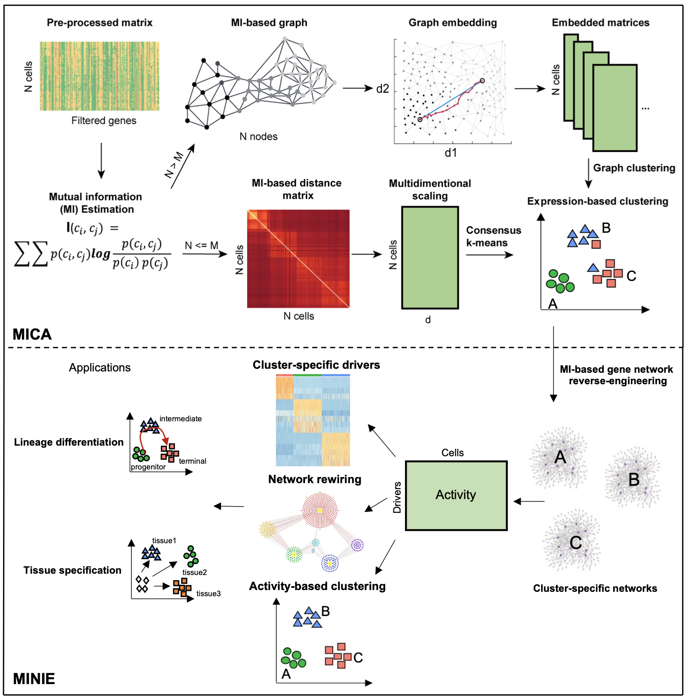
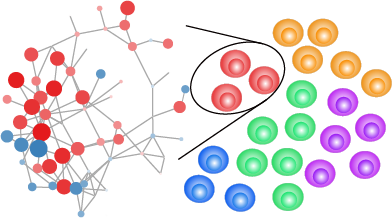
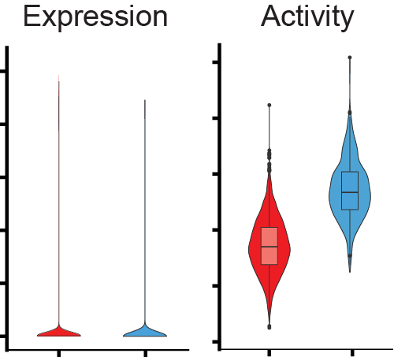

# Welcome to scMINER Documentation!

## Overview
We are excited to release **scMINER v1.0**, an R package designed for preprocessing, QC, clustering, and **hidden driver analysis** of single-cell RNA-seq data. scMINER enables mutual information-based cell clustering, cell-type-specific gene regulatory network (GRN) reverse engineering and protein activity inference, to identify hidden transcriptional factors (TFs) and signaling factors (SIGs) driving cellular lineage differentiation and tissue specific specification.

scMINER is also integrated with a suite of downstream analysis and visualization functions.

## Manuscript
The scMINER software is developed and maintained by the [Yu Laboratory @ St. Jude](https://www.stjude.org/directory/y/jiyang-yu.html) and is released under the Apache License (Version 2.0). Please consider citing [paper] if you find scMINER useful in your research.

## Why use scMINER?
scMINER includes the following key functions:

* Build `SparseEset` object for efficiently storing large-scale single-cell RNAseq data.

* Integrated quality control with a comprehensive html report.

* `MICA` stands for **M**utual **I**nformation-based **C**lustering **A**nalysis. MICA is a command line tool implemented in python for scalable clustering analysis and superior clustering purity.

* `MINIE` stands for **M**utual **I**nformation-based **N**etwork **I**nference **E**ngine. MINIE includes functions for GRN reverse engineering and protein activity inference for hidden drive analysis.

   With inferred protein activities, MINIE enables differential activity analysis. 

## Get started with scMINER
If you are new to scMINER, make sure to install scMINER following the [installation guide](install.md) and go though the basic tutorial which contains a step-by-step analysis of 14K Human Blood Mononuclear Cells (PBMCs). For a more advanced or ad_hoc analysis, please refer to other guided analysis or scMINER's high-level API.

## Support
We welcome your feedback! Feel free to open an [issue](https://github.com/jyyulab/scMINER/issues), send us an [email](mailto:jiyang.yu@stjude.org) if you encounter a bug, need our help or just want to make a comment/suggestion.
