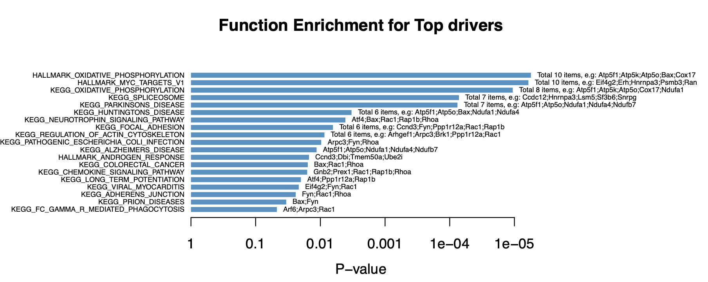

# scMINER Guided Analysis on functional enrichment
Visualization of functional enrichment of the regulons.

## Pathway enrichment
### Read in database

```R
# Read in database
library(NetBID2)
gs.preload(use_spe='Mus musculus',update=FALSE)
print(all_gs2gene_info)

```
### Fisher exact test

```R
# Get the Regulons of Batf in each cell states
driver_list <- rownames(Batftarget1)
Batftarget12<-intersect(Batftarget1$target,Batftarget2$target) ## overlapped Batf targets in Tpex and Teff-like Tex
res_up12 <- funcEnrich.Fisher(input_list=Batftarget12,use_gs=c('H',"CP:KEGG"), Pv_thre=0.05,Pv_adj = 'none',min_gs_size = 30, max_gs_size = 500)

draw.funcEnrich.bar(funcEnrich_res= res_up12,top_number=30,main='Function Enrichment for Top drivers',pdf_file=sprintf('%s/funcEnrich_bar_Batf.pdf','target/'),display_genes = TRUE)

```


### Visualize pathway enrichment in multiple conditions
```R
# Get the regulons of Batf in each cell state

res_up1 <- funcEnrich.Fisher(input_list=Batftarget1,use_gs=c('H',"CP:KEGG"), Pv_thre=0.05,Pv_adj = 'none',min_gs_size = 30, max_gs_size = 500)
res_up2 <- funcEnrich.Fisher(input_list=Batftarget2,use_gs=c('H',"CP:KEGG"), Pv_thre=0.05,Pv_adj = 'none',min_gs_size = 30, max_gs_size = 500)

res_up12$Cluster_ID<-'Overlap'
res_up1$Cluster_ID<-'Tpex'
res_up2$Cluster_ID<-'Teff-like'
rest_all1<-rbind(res_up12,res_up1,res_up2)
ggplot(rest_all1, aes(y = factor(reorder(`#Name`,Odds_Ratio)),  x = Cluster_ID))+
  geom_point(aes(colour = Odds_Ratio, size = -log10(Adj_P))) + 
  scale_color_gradient2(low = "blue",  mid = "white",high = "red") +
  labs(x="Odds_Ratio",y="Pathways")+
  scale_size(range = c(1, 6)) +
  theme_bw() +
  theme(axis.text.x=element_text(angle=45,hjust=1))
  
```

