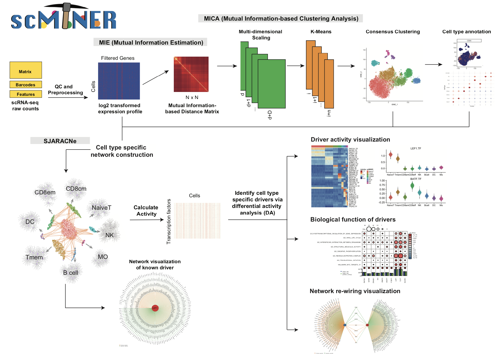

# scMINER: Single-Cell Mutual Information-based Network Engineering Ranger

{:.no_toc}
**scMINER** is a **system biology** analysis frame work for high-throughput single cell RNA-seq data, implemented primarily in R and python. This package offers a combination of several individual tools including but not limit to [MICA](https://github.com/jyyulab/MICA) (Mutual Information based Clustering analysis) and [SJARACNe](https://github.com/jyyulab/SJARACNe). The main purpose of this pipeline is to **help identify subtypes, construct cell type specific networks, and identify hidden drivers.** 
{: .fs-5 .fw-300 }

[Get started now](#getting-started){: .btn .btn-primary .fs-5 .mb-4 .mb-md-0 .mr-2 } [View it on GitHub](https://github.com/jyyulab/scMINER){: .btn .fs-5 }

---

## Overview

 

