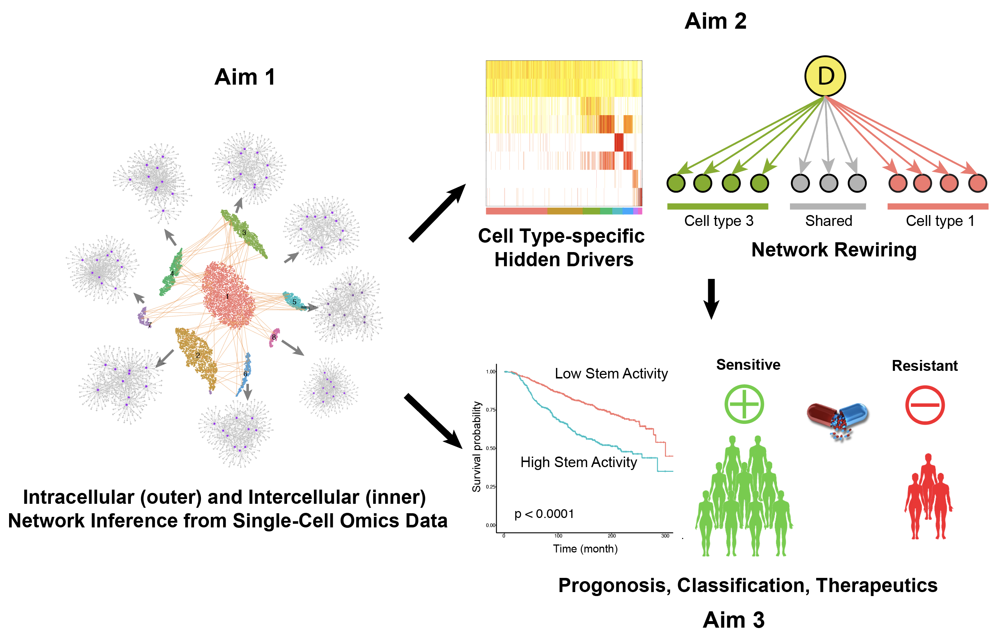

 

*scMINER* is a **system biology** analysis frame work for high-throughput single cell RNA-seq data implemented primarily in R and python. This package offers a combination of several individual tools including but not limit to [MICA](https://github.com/jyyulab/MICA) (Mutual Information based Clustering analysis) and [SJARACNe] (https://github.com/jyyulab/SJARACNe). Installation instructions for each individual tools are available on github through links above.

{: .fs-6 .fw-300 }

[Get started now](#getting-started){: .btn .btn-primary .fs-5 .mb-4 .mb-md-0 .mr-2 } [View it on GitHub](https://github.com/jyyulab/scMINER){: .btn .fs-5 }

---

## Getting started
### Dependencies
scMINER is depend on [python3](https://www.python.org/downloads/) and [R](https://www.r-project.org/). 

### Local installation: 
1. Install scMINER from github:
```R
#install dev_tool first install.packages(devtools)
devtools::install_github("jyyulab/scMINER") 
```
2. Install [MICA](https://github.com/jyyulab/MICA) from source:
```
$ git clone https://github.com/jyyulab/MICA
$ cd MICA
$ python setup.py install
```
3. Install [SJARACNe](https://github.com/jyyulab/SJARACNe) from source:
```
$ git clone https://github.com/jyyulab/SJARACNe
$ cd SJARACNe
$ python setup.py install
```

---

 


## About the project


### License

Just the Docs is distributed by an [MIT license](https://github.com/jyyulab/scMINER/blob/master/LICENSE).

### Contributing

When contributing to this repository, please first discuss the change you wish to make via issue,
email, or any other method with the owners of this repository before making a change. Read more about becoming a contributor in our GitHub repo.
