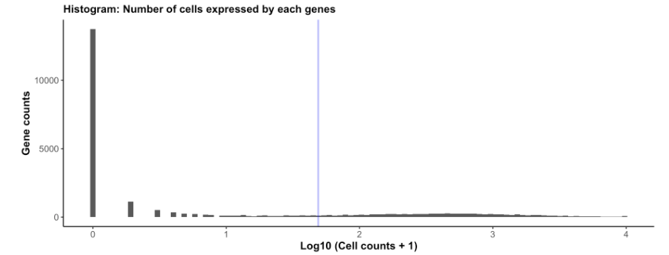
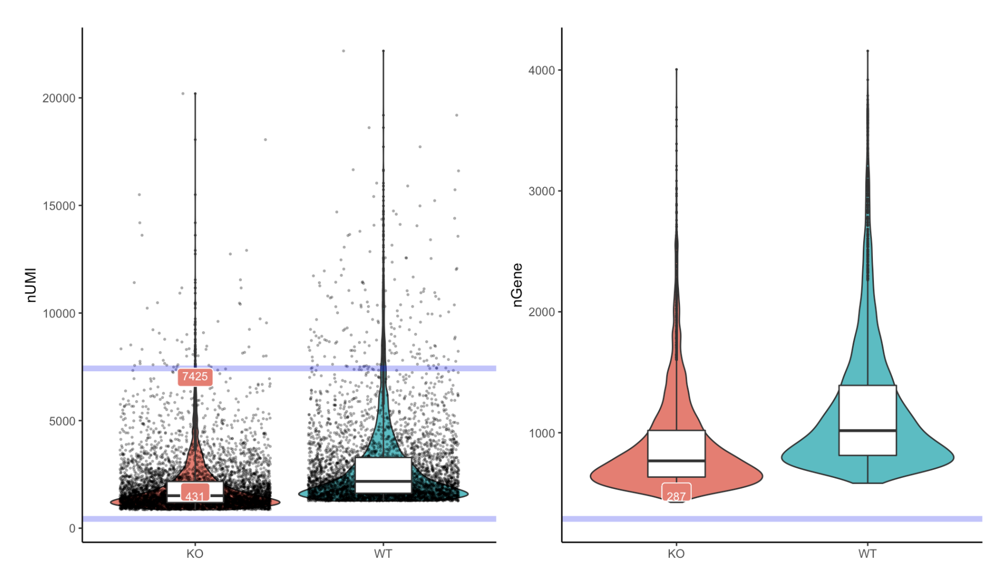
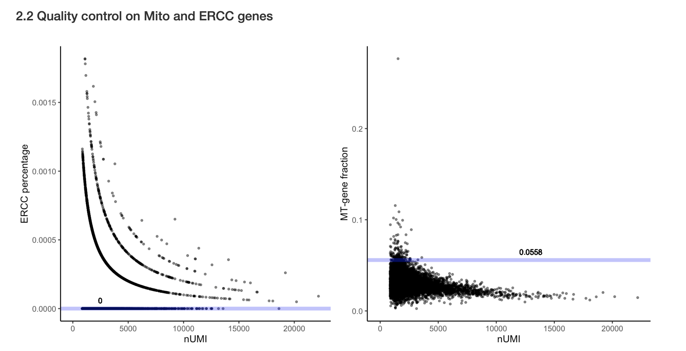
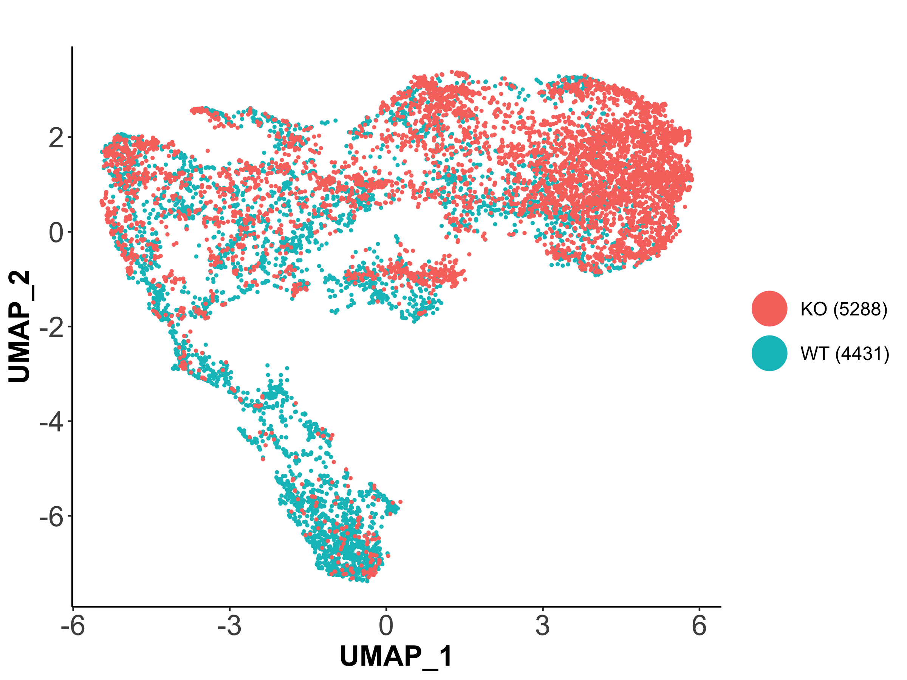
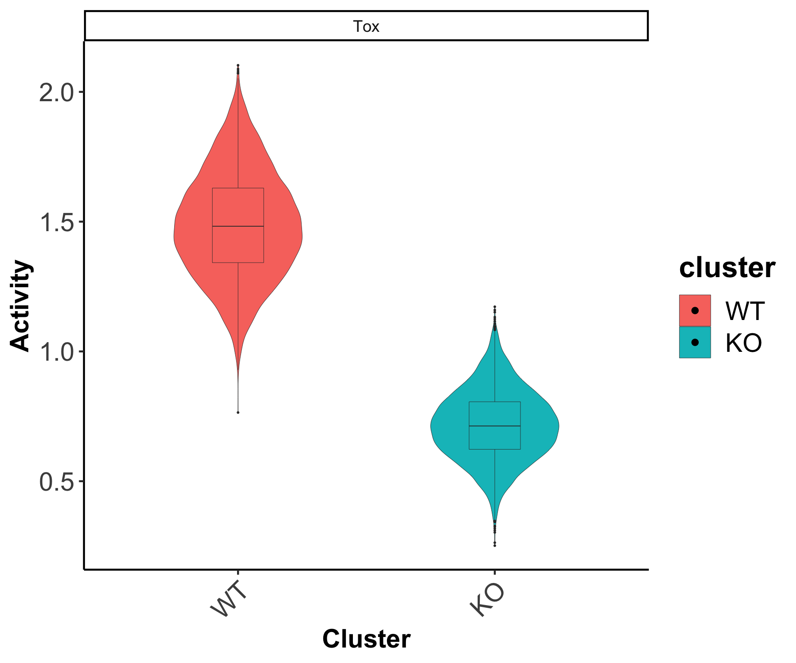
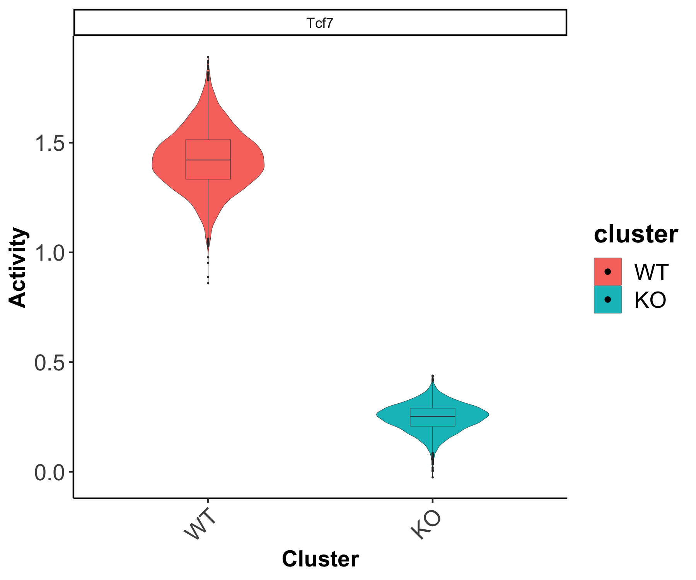

# scMINER Guided Analysis on WT and KO CD8+ T cell in chronic infection model
TOX is a master transcription factor for CD8+ T cell exhaustion during chronic infection. This tutorial introduce you scMINER's basic analysis using a WT and TOX KO CD8+ T dataset (GSE119940) [[Yao et al., Nat Immunol 2019](../reference.md#[Zheng et al., 2017])]. 


## Data loading and preprocessing

### Read 10x genomics data
We start by reading WT and KO data with function `readscRNAseqData()`. This function reads data from either 10x genomics standard output files (usually contains three individual files: matrix.mtx, barcodes.tsv, features.tsv) or other text files by passing arguments to `read.delim()`. The function creates a `SparseExpressionSet` object adapted from `ExpressionSet` class if set `CreateSparseEset=T`; otherwise, it creates a list object that stores expression data, feature data and sample data under three separate slots. If `add.meta=T`, then additional sample info such as total number of UMI will be calculated and stored in the object. The following command sets `is.10x=T`, `CreateSparseEset = F`, and `add.meta=F`.


```R
# Create a SparseExpressionSet object with meta info
d.WT <- readscRNAseqData(file = "./D7WT/", is.10x = T, CreateSparseEset = F, 
                                  add.meta = F)
d.KO <- readscRNAseqData(file = "./D7TOXKO/", is.10x = T, CreateSparseEset =F, 
                                  add.meta = F)
```

Then a merged WT and KO SparseEset object can be created by using `CreateSparseEset()` function.

```R
# merge WT and KO dataset
colnames(d.WT$raw.data)<-paste0("WT_",colnames(d.WT$raw.data))
colnames(d.KO$raw.data)<-paste0("KO_",colnames(d.KO$raw.data))
mat<-cbind(d.WT$raw.data,d.KO$raw.data)
meta.data.WT<-d.WT$meta.data
meta.data.WT$group<-'WT'
meta.data.KO<-d.KO$meta.data
meta.data.KO$group<-'KO'
rownames(meta.data.WT)<-paste0("WT_",rownames(meta.data.WT))
rownames(meta.data.KO)<-paste0("KO_",rownames(meta.data.KO))
meta.data<-rbind(meta.data.WT,meta.data.KO)

# Set add.meta=T to run the quality control and store the info in the object
eset.raw<-CreateSparseEset(data=mat,meta.data = meta.data,feature.data = d.WT$feature.data,add.meta = T)

```


### Quality control and data filtering
Quality control assessments can be performed using `draw.scRNAseq.QC()` function, which outputs a html report generated through Rmarkdown [CD8T_scRNAseq_QC.html](../htmls/CD8T_scRNAseq_QC.html). The report includes three essential quality control figures at both gene and cell levels. Suggested cutoffs will be returned as a list if set `output.cutoff=TRUE`.

```R
cfs<-draw.scRNAseq.QC(SparseEset = eset.raw,project.name = "CD8T",plot.dir = "./")
```

The histogram plot visualizes a distribution of expressed genes among each cells. The blue vertical line shows the recommended cutoff (0.5% * number of cells) to filter lowly expressed cells.



The violin plot visualizes the total UMI count and the total number of genes expressed in violin plots. Horizontal blue line indicates suggested high/low cutoffs. Suggested thresholds were computed based on Median ± 3 * MAD (maximum absolute deviance). Suggested threshold numbers are also printed right above blue lines in labels.



The scatter plot shows mitochondrial gene expression percentage, and spike-in genes expression percentage (if spike-in genes exist) for each cell vs. the total number of UMIs. Cells with a high percentage of mitochondrial gene expression but a low total number of UMI counts are often considered as low quality cells (above the horizontal line).



We recommend using the thresholds in `cutoffs` list returned by `draw.scRNAseq.QC()` function. 

```R
# Perform the actual filtering
eset.sel <- preMICA.filtering(SparseEset = eset.raw, cutoffs = cfs) 
```


### Normalization and transformation
We recommend count per million reads (CPM) normalization and log2 transformation (required) for performing MICA clustering analysis.

```R
norm = 1e6 
exp.norm <- sweep(exprs(eset.sel), 2, 
                  norm/unname(Matrix::colSums(exprs(eset.sel))), '*')

# log transformation (required by MICA)
exp.log2 <- log(exp.norm + 1, base = 2)

# save as SparseEset
eset.log2 <- CreateSparseEset(data=exp.log2, 
                              meta.data = pData(eset.sel), 
                              feature.data = fData(eset.sel), 
                              add.meta = F)
```


## Perform clustering analysis via MICA
After reviewing all the QC plots and finishing filtering, it is ready to perform clustering analysis. MICA is implemented in Python as a standalone command line tool. Thus we suggest saving your working directory and R session prior to running MICA.


### Generate MICA input
`generateMICAinput()` function takes a log transformed expression matrix as input, and outputs a cell by gene matrix stored in .h5 (default) or .txt file as input to MICA.

```R
# Prepare MICA input
generateMICAinput(d= exp.log2 ,filename="../MICA/CD8T_MICA_input.txt")

# (optional) Clean working environment
rm(exp.log2)
rm(exp.norm)
```


### Run MICA from the command line 
Pick a MICA command to run in a command line environment based on the number of cells of your dataset. For dataset with less than `5k` cells, MICA MDS mode is recommended.

```bash
mica lsf -j config_cwlexec.json -i ./MICA/CD8T_MICA_input.txt -p TOXKO -k 2 3 4 5 6 7 8 9 10 -o ./MICA/ -b 10 -dr MDS -v umap -d 0.01 -sn 1000 

```

Here, `-p` specifies a project name for naming the output files; `-k` is an array of integers delimited by a single space, where each integer specifies a `k` to perform a k-mean clustering; 


### Read MICA output
Function `readMICAoutput()` adds MICA clustering results to the `SparseEset` object created before, which will be the major data structure for downstream analysis. **Note: All the functions for downstream analysis are compatible with both `expressionSet` and `SparseExpressionSet`**. 

After choosing a clustering result based on known cell type signatures or silhouette scores (provided by GE mode). The clustering labels can be saved to `eset$ClusterRes` by setting `load_ClusterRes` as TRUE.

```R
# Load clustering results
eset.CD8T <- readMICAoutput(eset = eset.log2, load_ClusterRes = TRUE, 
                                     output_file = "MICA/TOXKO_k2_umap_ClusterMem.txt")
```

`MICAplot()` function can be used to visualize MICA clustering results using `ggplot`.

```R
# X, Y, color_by specify coordinate and clustering label entries in the eset phenoData; 
# pct is the size of the point
eset.CD8T$genotype<-factor(eset.CD8T$group,levels = c("KO","WT"))
MICAplot(input_eset = eset.CD8T, # label to print on x or y axis
           X = "X", Y="Y", # which meta variable was treated as x or y coordinates
           color_by = "genotype", pct = 0.6,show_label = F,label.size = 4)+
  theme(
    axis.title = element_text(size=18, face="bold"),
    axis.text  = element_text(size=18),legend.title = element_blank()
  )+xlab("UMAP_1")+ylab("UMAP_2")

```




## WT and KO cell network generation via SJARACNe
### Generate SJARACNe input
`generateSJAracneInput()` functions uses the annotated cell type information stored in `pData([your_expressionSet])` to generate inputs for running SJARACNe from the command line. The function partitions the input expression matrix and performs essential filtering (filter out not expressed genes in a cluster) to ensure a reliable network construction. `funcType` is required to specify the type of the network. If set `funcType="TF"`, a reference transcription factor list will be loaded automatically without manual input. However, you do need to define species information for your data using under `ref`.

This function creates one directory containing the required inputs (filtered expression matrix in .exp format and filtered TF list in .txt format) for each cell type. 

```R
generateSJARACNeInput(
	input_eset = eset.CD8T, funcType = "TF", 
	ref = "mm",  #mouse
	wd.src = "SJAR_CD8T/SJAR_TF",  #Output directory
	group_tag = "genotype")
	
generateSJARACNeInput(
	input_eset = eset.CD8T, funcType = "SIG", 
	ref = "mm",  #mouse
	wd.src = "SJAR_CD8T/SJAR_SIG",  #Output directory
	group_tag = "genotype")
```

### Run SJARACNe from the command line 
SJARACNe works as a separate module which was implemented in python and C++, refer to [SJARACNe](https://github.com/jyyulab/SJARACNe) github page for installation and basic usage. Please save your working directory before running SJARACNe. 

Here we provide an example to print SJARACNe commands for IBM LSF platform.  

```
indir = ./SJARACNe
cd $indir
for i in $(ls -d */ | cut -f1 -d'/'); do
echo sjaracne lsf -j $indir/config_cwlexec.json -e $indir/${i}/*.exp -g $indir/${i}/tf/*.txt -n 100 -o $indir/${i}/tf -pc 0.01;
done
```


## Identify genotype-specific hidden drivers via MINIE
Identify hidden driver from content-based network is the key step in scMINER to help understand your scRNA-seq data, and provide biological insight. 

### Calculate activity
Activity calculation is the basis of driver estimation in scMINER. To infer driver activity, expression profile of their targets are intergrated via function `GetActivityFromSJARACNe`. This function takes SJARACNe output path and expression set as input, and return an activity set as well as structured network files if set `save_network_files=TRUE`. **Please note that this function could only work if you used `generateSJARACNeInput` to create SJARACNe input directory and files.**

Since scRNA-seq data are extremly sparse and noisy, please set `activity.method` as `'unweighted'`. 

```R
acs.CD8T_tf <- GetActivityFromSJARACNe(
  SJARACNe_output_path ="./",
  SJARACNe_input_eset = eset.CD8T,
  activity.method="unweighted", # we highly recommend using 'unweighted' as activity calculation method
  activity.norm=TRUE, 
  group_tag = "genotype", # which group was used to partition expression profiles
  save_network_file=TRUE, 
  functype="tf",# whether or not save network for each group
  save_path="./networks_tf/") 
  
acs.CD8T_sig <- GetActivityFromSJARACNe(
  SJARACNe_output_path ="./",
  SJARACNe_input_eset = eset.CD8T,
  activity.method="unweighted", # we highly recommend using 'unweighted' as activity calculation method
  activity.norm=TRUE, 
  group_tag = "genotype", # which group was used to partition expression profiles
  save_network_file=TRUE, 
  functype="tf",# whether or not save network for each group
  save_path="./networks_sig/") 
```


### Driver estimation by differential activity analysis
The function `get.DA` was designed to perform differnetial activity analysis from SJARACNe inferred activity matrix. In this function, two-sided student's t-test will be performed to compare mean activity from one cell type V.S. the others. It will return a data frame that includes all TF occurred in original data. Statistics such as t.statistics, p-value, 95%CI, etc. are outputed to help identify hidden drivers. You can save it to file in order to check them manually. 

```R
DAG_result_tf <- get.DA(input_eset =acs.CD8T_tf,group_tag = "genotype")
DAG_result_sig <- get.DA(input_eset =acs.CD8T_sig,group_tag = "genotype")
```

We also offer a function called `get.Topdrivers` to help picking top drivers for each cell type. You can specify `n` as maximum number of top drivers to pick, and `degree_filter` to restrict number of targets. 

```R
TF_list <-get.Topdrivers(DAG_result = DAG_result_tf,
                             celltype = levels(acs.CD8T_tf$genotype), # ensure cluster order
                             n = 5, degree_filter = c(50,600))
```


```R
#check postive controls
p<-feature_vlnplot(input_eset = acs.CD8T_tf,feature = "geneSymbol",target=c("TOX","TCF7"),
                    ylabel = "Activity",group_by = "genotype", ncol=2)
```



In order to perform more advanced network analysis utilizing SJARACNe generated cell type specific networks, please infer detailed guidance under [Advanced analysis](../Advanced analysis/PBMC-14k-network) tab.

