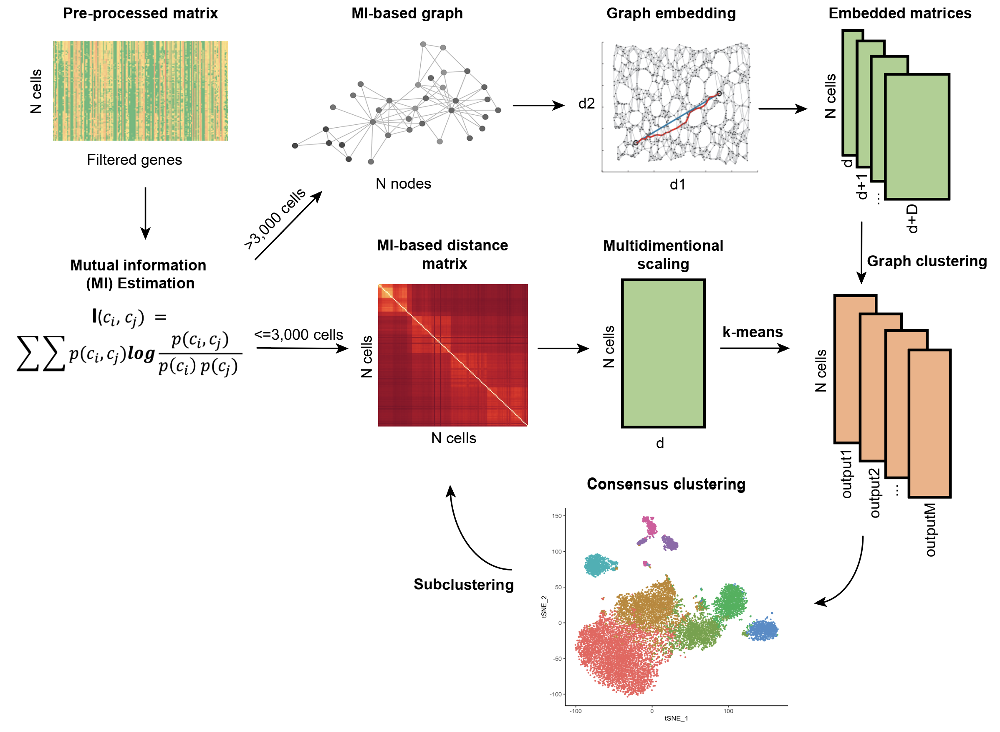

# Mutual information-based clustering analysis (MICA)

MICA is a clustering tool for single-cell RNA-seq data. MICA takes a preprocessed gene expression matrix as input and efficiently cluster the cells. MICA consists of the following main components:

1. Mutual information estimation for cell-cell distance quantification
2. Dimension reduction on the non-linear mutual information-based distance space
3. Consensus clustering on dimension reduced spaces
4. Clustering visualization and cell type annotation



## Using MICA
MICA consists of two modes named by the dimension reduction techniques: multi-dimensional scaling (**MICA MDS**) mode and graph embedding (**MICA GE**) mode. The MICA MDS mode is more robust for small datasets (less than `5000` cells by default) due to its global dimension reduction nature; the MICA GE mode works better for large datasets (more than `5000` cells) using a graph embedding approach to explore distant neighbor cells.

### MICA GE mode
As mentioned above, the MICA GE mode reduces the dimensionality using the graph embedding method. It sweeps a range of resolutions to perform Louvain clustering for each resolution in the range. It also performs silouette analysis as an reference for the selecting of the optimal number of clusters. 

#### MICA GE commands
The simplest way to MICA GE mode is to provide `mica ge` a preprocessed expression matrix file in either .h5ad or .txt format, and a path to an output directory.
```
mica ge -i ./test_data/inputs/10x/PBMC/3k/pre-processed/pbmc3k_preprocessed.h5ad -o ./test_data/outputs
```

The default number of workers to run in parallel is `1`. To increase the number of workers (recommended), use `-nw` option.
```
mica ge -i ./test_data/inputs/10x/PBMC/3k/pre-processed/pbmc3k_preprocessed.h5ad -o ./test_data/outputs -nw 25
```

To increase the upper limit of the range of resolutions to `4.0`, use `-ar` option; to decrease the step size for sweeping resolutions to `0.1`, use `-ss` option.
```
mica ge -i ./test_data/inputs/10x/PBMC/3k/pre-processed/pbmc3k_preprocessed.h5ad -o ./test_data/outputs -nw 25 -ar 4.0 -ss 0.1
```
See below the description of other parameters.

#### Description of output files
Typical MICA GE mode output files include:

`clustered.h5ad`: a `.h5ad` file with preprocessed gene expression matrix, cell and gene meta information and clustering results included.

`silhouette_avg.txt`: a `.txt` file with four columns dimension, resolution, num_clusters and silhouette_avg. silhouette_avg is the average silhouette scores of all the cells. In theory, a higher silhouette_avg value indicates a purer clustering result. However, the peak silhouette_avg value is usually biased towards fewer number of clusters. It is recommended to check a few clustering results whose silhouette_avg values are close to the peak silhouette_avg value. For example, the peak silhouette_avg value for the PBMC14k dataset corresponds to the clustering results with 4 clusters; the clustering results with 7 clusters (known 7 sorted populations) have relatively smaller silhouette_avg values.

```
dimension resolution  num_clusters	  silhouette_avg
24	      2.71828 	  7         	  0.5391235947608948
24	      3.00417     7	              0.539175271987915
24	      3.32012	  6	              0.5465611219406128
24	      3.6693	  6   	          0.5463876128196716
24	      4.0552	  6   	          0.5127292275428772
24	      4.48169	  6   	          0.512337863445282
24	      4.95303	  6   	          0.5124161839485168
24	      5.47395	  5   	          0.4783124029636383
24	      6.04965	  5   	          0.5457172393798828
24	      6.68589	  5   	          0.5456818342208862
24	      7.38906	  5   	          0.54740309715271
24	      8.16617	  4   	          0.6289374232292175
24	      9.02501	  4   	          0.6288570761680603
```

For each Louvain clustering resolution, MICA GE generates three output files.
`clustering_UMAP_euclidean_24_3.6693.txt`: a tab-delimited text file with four columns `ID` (cell barcode ID),  `X`, `Y` (UMAP or tSNE coordinates), `label` (predicted clustering label). `euclidean` in the file name indicates the distance function used for the clustering on the embedded space, `24` is the number of reduced dimensions, `3.6693` is the Louvain clustering resolution. 

```
ID              X           Y           label 
CACTTTGACGCAAT  -4.6490397  14.635475   1
GTTACGGAAACGAA  -4.099431   11.762381   1
AGTCACGACAGGAG  -4.75394    3.9216163   4
TTCGAGGACCAGTA  -5.1016173  4.8917494   4
CACTTATGAGTCGT  -3.1518545  15.187379   1
GCATGTGATTCTGT  -3.6067667  14.740933   1
TAGAATACGTATCG  -4.634878   12.530589   1
```

`clustering_UMAP_euclidean_24_3.6693.pdf`: an UMAP plot file whose name schema is the same as above clustering label file.

`silhouette_2_6_3.6693.pdf`: a silhouette plot file, where `2` is the number of UMAP dimensions, `6` is the number of clusters.

#### Description of important parameters
MICA GE exposes a number of useful optional command-line parameters to the user. The particularly important ones are explained here, but you can always run `mica ge -h` to see them all.

`--num-neighbors-mi`<br />
Number of neighbors to build mutual information-based nearest neighbor graph. The default value is `80`. This parameter has a significant impact on the clustering performance and run time.


`--num-walks`<br />
Number of workers to run in parallel. The default value is `1`. We suggest using `25`. The parallelizable steps are MI-based kNN, dimension reduction and UMAP visualization.


`--num-neighbor-euclidean`<br />
Number of neighbors to build euclidean distance-based nearest neighbor graph after dimension reduction. The default value is `20`. This parameter affects clustering performance and maximum memory usage.


`--num-walks`<br />
Number of random walks per source for the node2vec graph embedding. The default value is 110.


`--window-size`<br />
Context window size of a random walk for the node2vec graph embedding. The default value is 10.


`--hyper-p`<br />
Hyperparameter p controls the likelihood of immediately traveling back to a node recently traversed of a random walk. The default value is 2.8.


`--hyper-q`<br />
Hyperparameter q controls the likelihood of walking away from the previous node of a random walk. The default value is 0.4.


**Note**: all the parameter tunings with respect to clustering performance, run time and maximum memory usage are based on PBMC20k dataset.


#### Total running time

###### PBMC (20k)


| Step        | Time (s)    |
| ----------- | ----------- |
| MI-kNN      | 2278        |
| node2vec    | 418         |
| clustering  | 60          |
| UMAP        | 710         |
| silhouette  | 319         |
| total       | 3785 (1.05h)|

###### Human Motor Cortex


| Step        | Time (s)    |
| ----------- | ----------- |
| MI-kNN      | 12233       |
| node2vec    | 1553        |
| clustering  | 401         |
| UMAP        | 3235        |
| silhouette  | 4005        |
| total       |21427 (5.95h)|


### MICA MDS mode
The MICA MDS mode performs stable on small datasets (including bulk datasets) but the memory usage grows quadratically as the number of cells increases. `k`-mean is the default clustering method, which requires users to specify the number of clusters (`k` in `k`-mean clustering). Due to the memory limitation, the workflow is implemented using common workflow language (CWL) for the scattering and gathering on the expression matrix.


#### MICA MDS commands
The simplest way to MICA MDS mode is to provide `mica mds` a preprocessed expression matrix file in either .h5ad or .txt format, a path to an output directory, a project name, and the number of estimated clusters (a number or a space-delimited list) of your dataset.
```
mica mds -i ./test_data/inputs/10x/PBMC/3k/pre-processed/pbmc3k_preprocessed.h5ad -o ./test_data/outputs -pn PBMC3k -nc 8 9 10
```

#### Description of output files
Typical MICA MDS mode output files include:

`project_name_k10_umap_ClusterMem.txt`: a tab-delimited text file with four columns `ID` (cell barcode ID),  `X`, `Y` (UMAP or tSNE coordinates), `label` (predicted clustering label). `project_name` in the file name is given by the parameter `-p`, `10` is the number of clusters.

`project_name_k10_umap.png`: an UMAP plot file whose name schema is the same as above clustering label file.

`project_name_dist.h5`: a `.h5ad` file with the merged distance matrix.

`project_name_reduced.h5`: a `.h5ad` file with the MDS reduced matrix.


#### Description of Important Parameters
MICA MDS exposes a number of useful optional command-line parameters to the user. The particularly important ones are explained here, but you can always run `mica mds -h` to see them all.

`-dk`<br />
The number of reduced dimensions used in `k`-mean clustering, array inputs are supported. The default value is `[19]`.

`--platform`<br />
Computing platform to run the CWL workflow. Can be `local` (cwltool) or `lsf` (cwlexec). The default value is `local`.

`--config-json`<br />
LSF-specific configuration file in JSON format to be used for the CWL workflow execution. Required if use `lsf` platform.

`--bootstrap`<br />
The maximum number of iterations per dimension to perform `k`-mean clustering. The default value is `10`.

`--thread-number`<br />
Number of workers used for multiple `k`-means iterations, usually equals to `--bootstrap`. The default value is `10`.

`--slice-size`<br />
The number of cells per sliced matrix for scattering and gathering parallelism. The default value is `1000`.
