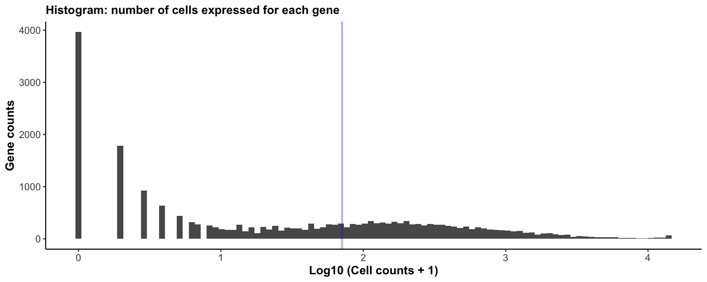
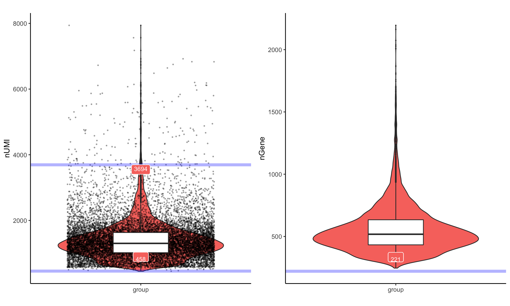
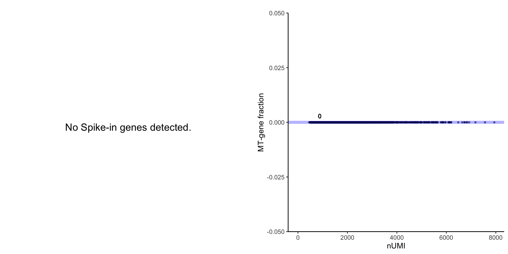
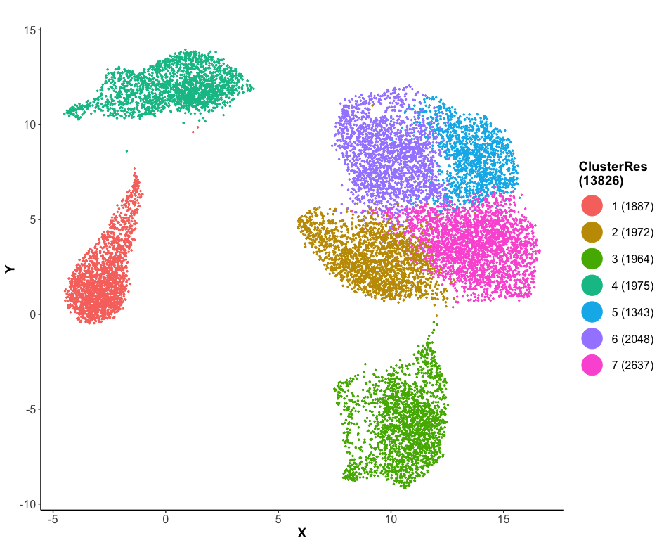
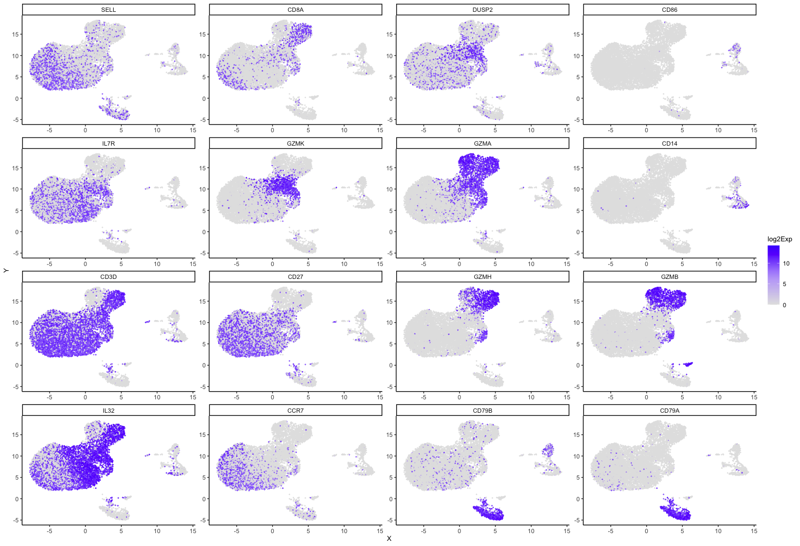
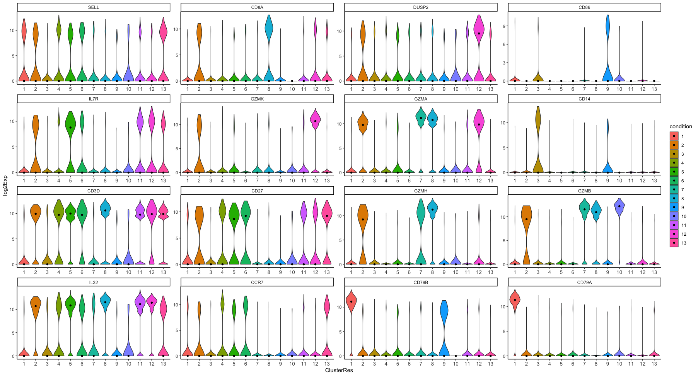
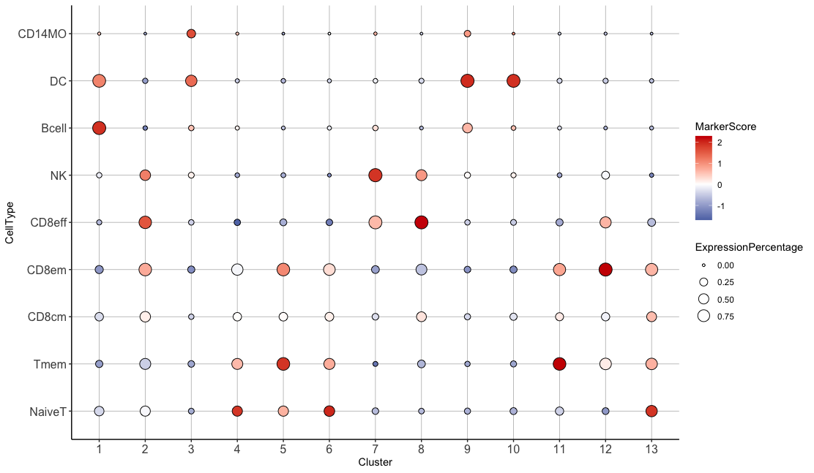

# scMINER Guided Analysis on 14k PBMCs from 10x Genomics
This tutorial introduce you scMINER's basic analysis using a PBMC dataset with 10 sorted populations of 2k cells per population [[Zheng et al., 2017](../reference.md#[Zheng et al., 2017])]. We remove CD34+ cells, CD4+ helper T cells, and total CD8+ cytotoxic cells from the dataset because of low sorting purity or a significant overlap with other immune cells based on the sorting strategy, which creates a new dataset with seven known cell types and 14k cells in total. The original dataset is freely available under accession number [SRP073767](https://www.ncbi.nlm.nih.gov/sra?term=SRP073767) and [Zenodo](https://zenodo.org/record/3357167#.YhQNF2RKj6V).


## Data loading and preprocessing

### Read 10x genomics data
We start by reading the downsampled 10x genomics data with function `readscRNAseqData()`. This function reads data from either 10x genomics standard output files (usually contains three individual files: matrix.mtx, barcodes.tsv, features.tsv) or other text files by passing arguments to `read.delim()`. The function creates a `SparseExpressionSet` object adapted from `ExpressionSet` class if set `CreateSparseEset=T`; otherwise, it creates a list object that stores expression data, feature data and sample data under three separate slots. If `add.meta=T`, then additional sample info such as total number of UMI will be calculated and stored in the object. The following command sets `is.10x=T`, `CreateSparseEset = T`, and `add.meta=T`.

To load data from standard 10x genomics files, creating a `SparseEset` directly is recommended.

```R
# Create a SparseExpressionSet object with meta info
pbmc.14k.eset <- readscRNAseqData(file = "./PBMC14k_input/", is.10x = T, CreateSparseEset = T, 
                                  add.meta = T)
```

The following code loads data that are not from standard 10x genomics files.

```R
# Read the data as a data.frame (not create SparseExpressionSet object or add meta info)
pbmc.14k <- readscRNAseqData(file="./PBMC14k_input/PBMC_20k_MICA_input_filter_14k.txt", 
                             is.10x = F, CreateSparseEset = F, add.meta = F, sep='\t')
```

Then a SparseEset object can be created by using `CreateSparseEset()` function.

```R
# Set add.meta=T to run the quality control and store the info in the object
pbmc.14k.eset <- CreateSparseEset(data = t(as.matrix(pbmc.14k)), add.meta = T)

# (Optional) Define your group information. If there is no additional sample info available, 
# just put a character here
pbmc.14k.eset$group <- sapply(strsplit(pbmc.14k.eset$cellName, "-"), "[",2)
```


### Quality control and data filtering
Quality control assessments can be performed using `draw.scRNAseq.QC()` function, which outputs a html report generated through Rmarkdown [PBMC14K_QC_report.html](../htmls/PBMC14k_scRNAseq_QC.html). The report includes three essential quality control figures at both gene and cell levels. Suggested cutoffs will be returned as a list if set `output.cutoff=TRUE`.

```R
cutoffs <- draw.scRNAseq.QC(SparseEset = eset.14k, project.name = "PBMC14k", plot.dir = "./QC/",
                            group = "group", # the meta info to group violin plots
                            output.cutoff = TRUE) # Output suggested cutoffs
```

The histogram plot visualizes a distribution of expressed genes among each cells. The blue vertical line shows the recommended cutoff (0.5% * number of cells) to filter lowly expressed cells.



The violin plot visualizes the total UMI count and the total number of genes expressed in violin plots. Horizontal blue line indicates suggested high/low cutoffs. Suggested thresholds were computed based on Median ± 3 * MAD (maximum absolute deviance). Suggested threshold numbers are also printed right above blue lines in labels.



The scatter plot shows mitochondrial gene expression percentage, and spike-in genes expression percentage (if spike-in genes exist) for each cell vs. the total number of UMIs. Cells with a high percentage of mitochondrial gene expression but a low total number of UMI counts are often considered as low quality cells (above the horizontal line).



We recommend using the thresholds in `cutoffs` list returned by `draw.scRNAseq.QC()` function. However, users can adjust the thresholds manually, e.g., `cutoffs$umi_cf_hi <- Inf` will not filter on outliers caused by a high total UMI values.

```R
# Perform the actual filtering
pbmc.14k.eset.filter <- preMICA.filtering(SparseEset = pbmc.14k.eset, cutoffs = cutoffs) 
```


### Normalization and transformation
We recommend count per million reads (CPM) normalization and log2 transformation (required) for performing MICA clustering analysis.

```R
norm = 1e6 
exp.norm <- sweep(exprs(pbmc.14k.eset.filter), 2, 
                  norm/unname(Matrix::colSums(exprs(pbmc.14k.eset.filter))), '*')

# log transformation (required by MICA)
exp.log2 <- log(exp.norm + 1, base = 2)

# save as SparseEset
pbmc.14k.eset.log2 <- CreateSparseEset(data = exp.log2, meta.data = pData(pbmc.14k.eset.filter), 
                                       feature.data = fData(pbmc.14k.eset.filter), add.meta = F)
```


## Perform clustering analysis via MICA
After reviewing all the QC plots and finishing filtering, it is ready to perform clustering analysis. MICA is implemented in Python as a standalone command line tool. Thus we suggest saving your working directory and R session prior to running MICA.


### Generate MICA input
`generateMICAinput()` function takes a log transformed expression matrix as input, and outputs a cell by gene matrix stored in .h5 (default) or .txt file as input to MICA.

```R
# Prepare MICA input
generateMICAinput(d = exp.log2 , filename = "./PBMC14k_MICA_input.h5ad")

# (optional) Clean working environment
rm(exp.log2)
rm(exp.norm)
```


### Run MICA from the command line 
Pick a MICA command to run in a command line environment based on the number of cells of your dataset. For dataset with less than `5k` cells, MICA MDS mode is recommended.

```bash
mica mds -i ./PBMC14k_MICA_input.h5ad -o ./outputs -pn PBMC14k -nc 8 9 10 -dk 14 13 14 15 16 17 18 19
```

Here, `-pn` specifies a project name for naming the output files; `-nc` is an array of integers delimited by a single space, where each integer specifies a `k` to perform a k-mean clustering; `-dk` can be an integer or an array of integers delimited by a single space (default is `19`), it specifies the number of dimensions used in k-mean clusterings. Use `mica mds -h` to see more options of MICA MDS mode.

For datasets with more than `5k` cells, MICA GE mode is recommended.

```bash
mica ge -i ./PBMC14k_MICA_input.h5ad -o ./outputs -ar 4.0 -nw 10 -nnm 100 -pdm 3.0
```

Here, `-ar` determines the maximum size of the communities (default: 3.0); `-nw` specifies the number of workers to run in parallel (default: 10); `-nnm` is the number of neighbors to build mutual information-based nearest neighbor graph (default 100); `-pdm` stands for pruning degree multiplier, the vertex with degree greater than pruning_degree_multi * num_neighbors_mi will be pruned. Use `mica ge -h` to find more options of MICA MDS mode.

A more detailed description of important parameters can be found in [API]() page.


### Read MICA output
Function `readMICAoutput()` adds MICA clustering results to the `SparseEset` object created before, which will be the major data structure for downstream analysis. **Note: All the functions for downstream analysis are compatible with both `expressionSet` and `SparseExpressionSet`**. 

After choosing a clustering result based on known cell type signatures or silhouette scores (provided by GE mode). The clustering labels can be saved to `eset$ClusterRes` by setting `load_ClusterRes` as TRUE.

```R
# Load clustering results
pbmc.14k.eset.log2 <- readMICAoutput(eset = pbmc.14k.eset.log2, load_ClusterRes = TRUE, 
                                     output_file = "MICA/clustering_UMAP_euclidean_24_1.82212.txt")
```
Note in `clustering_UMAP_euclidean_24_1.82212.txt`, `24` is the number of reduced dimensions, `1.82212` is the resolution used for Louvain clustering.

`MICAplot()` function can be used to visualize MICA clustering results using `ggplot`.

```R
# X, Y, color_by specify coordinate and clustering label entries in the eset phenoData; 
# pct is the size of the point
MICAplot(input_eset = pbmc.14k.eset.log2, X = "X", Y = "Y", color_by = "ClusterRes", pct = 0.5)
```




## Cell type annotation after clustering

### Marker gene visualization
To help with identifing the optimal number of clusters and annotating the clusters, selected marker genes can be visualized with UMAP/t-SNE scatterplots, violin plots or heatmap plots via function `feature_highlighting()`, `feature_vlnplot()` and `feature_heatmap()` respectively.

```R
genes_of_interest <-c("CD3D", "CD27", "IL7R", "SELL", "CCR7", "IL32", "GZMA", "GZMK", "DUSP2", 
                      "CD8A", "GZMH", "GZMB", "CD79A", "CD79B", "CD86", "CD14")

# UMAP scatter plot
feature_highlighting(input_eset = pbmc.14k.eset.log2, target = genes_of_interest, 
                     feature = "geneSymbol", ylabel = "log2Exp", x = "X", y = "Y", pct.size = 0.5)
```



```R
# Violoin plot
feature_vlnplot(input_eset = pbmc.14k.eset.log2, target = genes_of_interest, 
                feature = "geneSymbol", group_by = "ClusterRes", ylabel = "log2Exp", ncol = 4)
```




```R
# Heatmap plot
feature_heatmap(input_eset = pbmc.14k.eset.log2, target = genes_of_interest, group_name = "ClusterRes",
                save_plot = FALSE, width = 6, height = 6, name = "log2Exp")
```


### Cell type annotation
With a pre-defined marker gene list, `marker_bbplot()` function calculates a cell type signature score (weighted mean using the given weights in the marker list) for each cluster, and visualize all the signature scores using a bubble plot. Here, we curated a list of well-known marker genes of 9 common immune cell types and use these genes to calculate a marker score for each of the predicted PBMC clusters. **Note: the pre-defined marker gene list has a required format. See `head(makers)` below**.

```R
# Read marker genes from an excel file
markers <- read.xlsx("Immune_signatures.xlsx")

# Maker gene file has 3 required columns
head(markers)
  celltype markers weight
1 Monocyte    CD14      1
2 Monocyte  FCGR3A      1
3 Monocyte  FCGR3B      1
4 Monocyte   PTPRC      1
5 Monocyte  S100A8      1
6 Monocyte  S100A9      1

# Draw a bubble plot
draw.marker.bbp(ref = markers, input_eset = pbmc.14k.eset.log2, width = 6, height = 4, 
                feature = "geneSymbol", group_name = "ClusterRes", save_plot = FALSE)
```




Before diving into network generation section, assign the annotated cell types as factors in your expression set for keeping the current order of the clusters in following visualizations. **Please do not include "_" in your cell type names as it would cause mis-parsing in the following analysis.**.

```R
indx <- factor(x=c("Monocyte", "CD8NaiveCTL", "NK", "Bcell", "CD4TReg", "CD4TCM", "CD4NaiveT"),
              levels=c("Monocyte", "CD8NaiveCTL", "NK", "Bcell", "CD4TReg", "CD4TCM", "CD4NaiveT"))
pbmc.14k.eset.log2$celltype <- indx[pbmc.14k.eset.log2$ClusterRes]
```


## Network generation via SJARACNe
### Generate SJARACNe input
`generateSJAracneInput()` functions uses the annotated cell type information stored in `pData([your_expressionSet])` to generate inputs for running SJARACNe from the command line. The function partitions the input expression matrix and performs essential filtering (filter out not expressed genes in a cluster) to ensure a reliable network construction. `funcType` is required to specify the type of the network. If set `funcType="TF"`, a reference transcription factor list will be loaded automatically without manual input. However, you do need to define species information for your data using under `ref`.

This function creates one directory containing the required inputs (filtered expression matrix in .exp format and filtered TF list in .txt format) for each cell type. 

```R
generateSJARACNeInput(
	input_eset = eset, funcType = "TF", 
	ref = "hg",  #human
	wd.src = "SJARACNe",  #Output directory
	group_tag = "celltype")
```

### Run SJARACNe from the command line 
SJARACNe works as a separate module which was implemented in python and C++, refer to [SJARACNe](https://github.com/jyyulab/SJARACNe) github page for installation and basic usage. Please save your working directory before running SJARACNe. 

Here we provide an example to print SJARACNe commands for IBM LSF platform.  

```
indir = ./SJARACNe
cd $indir
for i in $(ls -d */ | cut -f1 -d'/'); do
echo sjaracne lsf -j $indir/config_cwlexec.json -e $indir/${i}/*.exp -g $indir/${i}/tf/*.txt -n 100 -o $indir/${i}/tf -pc 0.01;
done
```


## Identify cell-type-specific hidden drivers via MINIE
Identify hidden driver from content-based network is the key step in scMINER to help understand your scRNA-seq data, and provide biological insight. 

### Calculate activity
Activity calculation is the basis of driver estimation in scMINER. To infer driver activity, expression profile of their targets are intergrated via function `GetActivityFromSJARACNe`. This function takes SJARACNe output path and expression set as input, and return an activity set as well as structured network files if set `save_network_files=TRUE`. **Please note that this function could only work if you used `generateSJARACNeInput` to create SJARACNe input directory and files.**

Since scRNA-seq data are extremly sparse and noisy, please set `activity.method` as `'unweighted'`. 

```R
acs.14k <- GetActivityFromSJARACNe(
    SJARACNe_output_path ="SJARACNE/",
    SJARACNe_input_eset = eset,
    activity.method="unweighted", # we highly recommend using 'unweighted' as activity calculation method
    activity.norm=TRUE, 
    group_tag = "celltype", # which group was used to partition expression profiles
    save_network_file=TRUE, # whether or not save network for each group
    save_path="./networks/") #default as false, but recommended to be TRUE
```


### Driver estimation by differential activity analysis
The function `get.DA` was designed to perform differnetial activity analysis from SJARACNe inferred activity matrix. In this function, two-sided student's t-test will be performed to compare mean activity from one cell type V.S. the others. It will return a data frame that includes all TF occurred in original data. Statistics such as t.statistics, p-value, 95%CI, etc. are outputed to help identify hidden drivers. You can save it to file in order to check them manually. 

```R
DAG_result <- get.DA(input_eset = acs.14k,group_tag = "celltype")
```

We also offer a function called `get.Topdrivers` to help picking top drivers for each cell type. You can specify `n` as maximum number of top drivers to pick, and `degree_filter` to restrict number of targets. 

```R
TF_list <-get.Topdrivers(DAG_result = DAG_result,
                             celltype = levels(acs.14k$celltype), # ensure cluster order
                             n = 5, degree_filter = c(50,600))
```


In scMINER, we provide a handful of visualizations to compare driver activity from different cell type/clusters. Here we demo two basic functions: `feature_heatmap` and `feature_vlnplot`. These functions could be used on either expression and activity matrix.

```R
feature_heatmap(input_eset = acs.14k, target = TF_list, group_tag = "celltype",feature = "geneSymbol",
                width = 6,height = 6, save_plot=TRUE, cluster_rows = FALSE,
                name = "Activity",plot_name="./21_TopTFHeatmap.png")
```
<center></center>

```R
#check postive controls
p<-feature_vlnplot(input_eset = acs.14k,feature = "geneSymbol",target=c("LEF1","TCF7","BATF","TBX21","IRF8","SPIB","BATF3","CEBPA"),
                    ylabel = "Activity",group_by = "celltype", ncol=2)
```
<center></center>


In order to perform more advanced network analysis utilizing SJARACNe generated cell type specific networks, please infer detailed guidance under [Advanced analysis](../Advanced analysis/PBMC-14k-network) tab.
